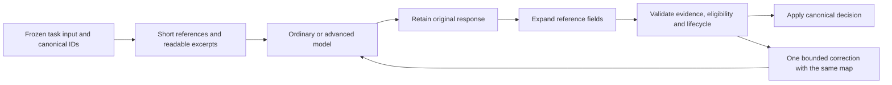
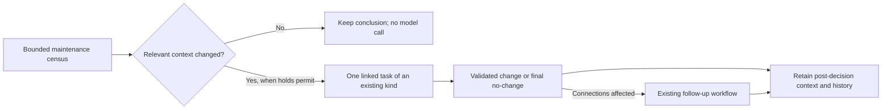
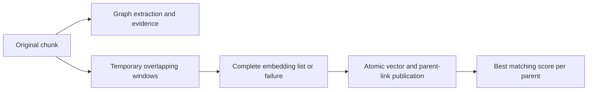
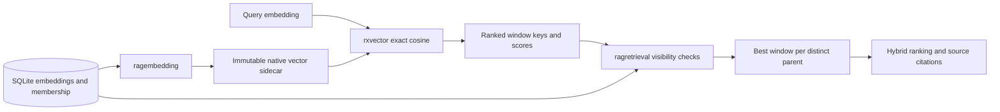

# Architecture

## Shape

`crexxrag` is a Level-G cREXX application packaged as one native executable.
The CLI, JSON/NDJSON, `ADDRESS RAG`, and MCP adapters translate into the same
typed command request and result vocabulary.

```text
human CLI / JSON / MCP / ADDRESS RAG
                 |
          ragproduct dispatcher
                 |
 config + policy + plans + jobs + retrieval + evidence
                 |
       cREXX SQL repositories and orchestration
                 |
       installed CREXX rxsqlite provider
                 |
     library.sqlite + immutable .rxvec sidecars
```

There is no second product implementation or compatibility bridge.

The [maintenance and ownership review](maintenance-refactoring-review-20260912.md)
distinguishes current owners from proposed extractions, prioritising shared
claim rules and domain prompt/contracts. Each proposal requires regression
characterization before implementation; a directory or executable split is
not itself an acceptance criterion.

## Claim-policy ownership

`ragclaimrules.effectiveclaimpolicy(profile, policy_version)` is the single
factory for the effective profile vocabulary and versioned stance weights.
Workers in `ragprocess`, public proposal commands and review acceptance compose
it. The legacy `ragproposalio.profileclaimpolicy` entry point delegates without
adding rules. `ragproposalio` owns bounded proposal decoding; `ragclaims` owns
typed validation, support decisions and transactional graph publication.
Dependencies run from orchestration through the factory to profile and claim
types, never from the validator back to process or command code.

Changing claim policy starts with `regression_claim_policy` and the ingestion,
external-review and grounding controls. See the
[staged delivery record](maintenance-refactoring-delivery.md) for qualification
and subsequent owners. Operator settings still enter through `crexxrag.conf`.

## Prompt and response-contract ownership

| Owner | Authoritative responsibility and consumers |
| --- | --- |
| `ragpromptdefaults` | Compatibility role objectives for older config formats; consumed by `ragconfigfile`. Explicit operator objectives remain config data. |
| `ragextractioncontract` | Effective extraction messages, profile-shaped schema and optional assessment extension; consumed by `ragapplicationprovider` and prompt inspection. |
| `ragresolutioncontract` | Effective resolution messages, selected-span context, action field examples, shared initial/correction ordinary/final-route controls, bounded search/read/extraction requests, schema and subject/workflow action vocabulary. Both `ragapplicationprovider` and `ragbacklog` validation consume this vocabulary. |
| `ragresolutionreferences` | Versioned model-facing subject/concept/evidence references from one frozen resolution input. The message builder projects IDs; the provider boundary retains the map and expands response fields before normal backlog validation. |
| `ragquotationcontract` | Shared literal-quotation instructions and bounded correction feedback; normal `raggrounding` validation remains independent and authoritative. |
| `raganswercontract` / `raganswerreferences` / `ragreportcontract` | Answer and advisory-report message/schema pairs; answer references project a bounded context and restore canonical citations. Consumed by `ragqueryprovider` and `ragqueryservice`; token/byte ceilings remain in `ragquerypolicy`. |
| `ragpromptinspection` | Public projection of those same builders, including exact system/schema hashes; no provider or library access. |

Resolution contract `/8` requires every strict-schema property, including
`dispositions`. Non-lifecycle actions return an empty array; only split, merge
and retire may carry nonempty, exact-census impact. `ragbacklog` retains the
legacy absent-field form for already retained responses. The contract owner
verifies exact frozen `/7` prompt and schema hashes before an old queued item
uses the repaired `/8` request; the stored input and hashes remain immutable.
An unsupported or altered binding is refused with an evidence-refresh action.

`ragapplicationprovider` retains execution, input-envelope checks, receipt
recovery, secret redaction and extraction decoding/validation. `ragbacklog`
retains shared eligibility/order, durable deferral and evidence handoff, task
evidence validation and transactional lifecycle application. Its search/read
steps compose `ragretrieval` and `ragevidence`; the coordinator retains worker
fences and immutable receipts. Queue/status and public controls delegate to the
same owner. `raglifecycle` owns total and capability-specific reset baselines.
`ragmaintain.validatetypechange` owns the nonempty/different-type rule shared by
backlog response validation and transactional lifecycle application. The latter
also checks profile permission and lifecycle state. Backlog concept/note subject
selection is shared by preflight and application; an unchanged type must be
rejected before a lifecycle item is recorded, with `no-change` or `retain` as a
supported conclusion when justified. [ESC-OPS-03 evidence](esc-ops-03-delivery-20260919.md).
Actual advanced provider runs (including search/read and failed or corrected
responses) count through that shared capability-specific ledger. The ordinary
handoff remains in total usage without consuming the advanced route's allowance.
`ragbacklog._routecallcount` is used by selection, exhaustion, inspection,
frozen remaining-call instructions and validation; its inner task lookup uses
an explicit alias so outer task expressions stay correlated. All calls also
consume the existing job call/token/cost limits. See the
[ESC-OPS-02 regression and repair](advanced-call-budget-delivery-20260917.md).
`ragbacklog.resolutioncorrectioninput` projects the current allowance for an
already-admitted correction using that same ledger and the frozen route ceiling.
`ragapplicationprovider` verifies the original prompt binding first, then renders
this request-only view in both system text and presented input. It preserves
stored task/evidence bytes, reference IDs, admission policy and receipt replay;
normal observability stores the actual sent prompt/body. [ESC-OPS-04 evidence](esc-ops-04-qa-cleanup-delivery-20260919.md).
`ragassessment` and `ragenrich` retain their specialized provenance contracts.

Work observability follows these owners. `ragapplicationprovider` serializes
the original application request and redacts diagnostic text. `ragreceipts`
retains that request within the existing provider-intent transaction; recovery
receipts retain their existing validation contract. Provider adapters expose
rejected text through a separate diagnostic property, never as validated content.
`ragusage` composes diagnostic events into existing settlement/uncertainty
transactions. `ragoperationsquery` owns filtered example reads, paged inspection
and the optional job summary; `ragrepository` retains the shared job projection.
`ragbacklog` measures its checkpoint and claim-context transaction boundaries,
using `ragtrace` for failed-lock output when database writes are unavailable.
Diagnostic error formatting preserves the earlier worker exit classification.
No new schema, provider call, retry policy or prompt is part of inspection.
See [the bounded delivery record](observability-delivery-20260916.md).
Domain contract modules do not import the product dispatcher or provider
execution adapters. The optional extraction schema extension uses SQLite JSON
functions but changes no persistent data.

Resolution contract version 5 presents `S1` for the subject, `C1…` for concepts
and `E1…` for selected evidence. The mapping is deterministic for the immutable
input, reused by its single correction and retained-response recovery. It is
recorded as `resolution_references` in the original provider-request event,
outside the model request body. Raw model responses remain unchanged in receipts;
accepted decisions contain expanded canonical IDs. Projection/expansion changes
only structural reference fields, never source text, labels or reasons. Unknown
or wrong-kind references fail before ordinary validation; knowing a reference
does not confer candidate eligibility or override lifecycle freshness. `read`
still uses the exact corpus citation. External proposals retain canonical IDs;
version 4 inputs and specialized provenance extraction retain their earlier
full-ID representation. No persistent identity or schema changes.



Use `config prompt` to find the effective prompt, not just its configurable
objective. Runtime source context and correction history remain request data.
Golden wire checks protect the original text and schemas during extraction;
they are not a quality score or authority to accept an altered prompt. Any
later behavior change must update its domain contract and review canonical
identity, validation and retained-work compatibility together. Existing durable
identities are preserved by this refactor.

## Effective defaults and policy-file ownership

| Owner | Responsibility and callers |
| --- | --- |
| `ragworkerdefaults` | Default, minimum and maximum for worker lease, poll, guided deadline, replacement count, replacement backoff and rolling window. Typed validation, file parsing, process-controller and supervision bounds, lease claim/heartbeat checks and canonical default omission consume the same specification. |
| `ragconfigfile` | Bounded declarative parsing, relative paths and complete typed configuration construction. It owns no publication or command access. |
| `ragpolicyfile` | `config show/set/replace`, whole-candidate and referenced-profile validation, prompt-source pair edits, selected-file registry loading and `refreshpolicyrequest` for file-bound transports. CLI, dispatcher, MCP and ADDRESS compose it. |
| `ragpolicypublication` | Bounded file reads/hashes, serialized edit ownership, verified sibling staging and rename publication. It accepts already validated candidate bytes and opens only an adjacent coordination database. |
| `ragconfiguration` | Existing immutable library configuration history and reviewed prospective/operational transition; file publication never rewrites retained job snapshots. |

Replay compatibility is owned by `ragconfiguration.replaysnapshotmatches`.
It reads the immutable source/target snapshots once and compares distinct
source-scope/role bindings from the selected dead letters. Scopes retain their
connector prefix, such as `folder:scotland-overnight`. `ragcanonical.semanticconfigjson`
owns the common semantic field projection for both frozen JSON and typed current
configuration. Its unfiltered form preserves existing semantic identity bytes;
the replay form selects the relevant source, role and provider. The selected
profile remains compatible, and extractor discovery settings remain part of
its interpretation. Unrelated sources/providers and operational settings do not
veto replay. `ragwork` retains selection limits, current-target fencing, immutable
lineage, completed-work and uncertain-outcome handling. Worker continuation
still uses its original frozen request; replay creates explicitly requested
new work under current policy. These are separate operations, not duplicate
configuration rules.

Worker continuation uses `ragconfiguration.worksnapshotmatches`: it checks the
selected live job items' source, role and provider semantic bindings against
their immutable snapshot. Completed phases and unrelated source/provider
settings do not veto those items. A continuation with no live items keeps the
full semantic check because it may create its next batch. The claimed item is
checked again before any provider call. `ragconfigfile` must carry an explicit
legacy-format embedding batch size into typed configuration; provider maximum
validation still applies.

Worker defaults stay byte-compatible: poll 100 ms (10–60000), guided deadline
0 seconds (0–604800), two replacements (0–24), 5000 ms backoff (10–60000), and a
3600-second rolling window (1–86400). Explicit invalid typed values are rejected,
not converted to defaults. The wider budget/provider/retrieval default families
remain in their existing owners; this stage consolidates one bounded family.

The CLI routes file administration before eager policy loading, allowing invalid
policy repair without a library. File-bound MCP and ADDRESS retain the selected path
and use the same policy refresh helper after argument validation on every
ordinary product call. There is no stale-cache fallback. `ragcommand` owns the
shared request rebinding; the catalogue owns the new commands' schema and access.
Legacy typed MCP callers without a file retain their supplied registry behavior.
ADDRESS `LIBRARY OPEN` still validates its initial binding; its function interface
can inspect or repair an explicitly supplied policy without an open session.

Publication uses a stable adjacent SQLite file and `BEGIN EXCLUSIVE` with no
busy wait; a competing editor receives conflict status and must inspect again.
A process crash releases the native SQLite lock. The target hash is checked under
that lock and again after staged bytes are verified; rename is the publication
point. Success after rename remains success even if coordination cleanup fails,
with a diagnostic and the new hash. The file contains no second policy and is
never unlinked to recover a lock. Filesystem metadata, external-writer races and
power-loss guarantees have explicit [integration limits](integration-issues.md#policy-file-publication-metadata-and-durability).
Custom metadata preservation and policy-file power-loss durability are accepted
limitations by the 12 September decision; SQLite and receipt-recovery guarantees
remain unchanged.

## Public result and lexical boundaries

`ragresultpages` constructs repository result rows, explicit page metadata and
job-plan text pages. `ragrepository` owns the SQL projections and bounded plan
slice reads; `ragproduct` composes access checks and commands. `ragcommand`
validates at most 100 data records plus one bounded final cursor record, rather
than counting the cursor against the advertised data limit. Plans of every size are omitted from generic list values: summaries state
that detail is separate and link to
`job.plan`. SQLite supplies a bounded character slice on each detail read.

`ragquery` owns lexical query preparation. It preserves non-ASCII text,
including combining marks, for the installed Unicode tokenizer, and keeps
ASCII FTS syntax out of generated terms. Index normalization remains SQLite's
responsibility; evidence text and citation byte offsets are not rewritten.
See [public results and lexical repair](public-result-lexical-repair.md).

## Job deadlines, continuation and retry resets

`ragbacklog.setbacklogdeadline` owns deadline-only edits and reuses the existing
absolute-time parser. It preserves the original start time, changes the window
deadline/timing and appends a
`deadline-update` event in one writer transaction. Checkpoints read that same
window; no restart or new timer is needed. `ragcontinuation` retains continuation
transaction ownership. Expired ordinary continuation caps discovery at the
materialized item count and reuses the window duration without renewing any
allowance. Explicit `job deadline` preserves the original discovery limit.
An expired repeat of a named renewal cannot enter the ordinary completion path
or move its deadline. Cancelled jobs are not implicitly resumed.

`raglifecycle` owns effective item, maintenance-task and embedding retry counts.
Explicit `job reset-retries JOB|--all` records per-item cumulative baselines as
`retry-reset` events through `ragcontinuation`; it never edits old attempts,
provider runs, task attempt numbering or usage. Shared task/embedding identity
uses the largest retained baseline across its linked items. This prevents a
fresh repair/replay job from restoring the old exhausted count. Active work is
excluded from the settled reset baseline and still consumes the new allowance.
Actual totals remain separately reportable (`recorded_calls` versus
`retry_calls`). Existing retry requests and their holds retain their owner.

The reset is a set-based insert under one writer transaction, with unchanged
baselines skipped. Existing item/attempt, task-item, embedding-identity and
job-event indexes serve the reads. No schema change, rolling-time retry policy,
background reset process, budget renewal or automatic retry is introduced.
CLI/MCP schemas and routing remain in `ragcommandcatalog`.

### Task reset

`ragbacklog.resetbacklogtasks` owns `maintain reset TASK` and `maintain reset
--all`; `ragcommandcatalog` exposes the same operation as `rag_task_reset`.
This is operational recovery to current evidence and knowledge policy. A fresh
successor starts pending with zero attempts, semantic failures and retry delay,
standard capability and the current question. The original becomes superseded;
its accepted facts and provider receipts are retained. Missing subjects close
without invented evidence. `--all` does not reopen completed tasks. An explicit
`maintain reset TASK` may reconsider a completed assessment under the approved
maintenance convergence policy. Pending old
reviews and retry requests are retired; queued old work is cancelled and old
waivers do not attach to the successor. Running items must drain; `--all` skips
those tasks and reports the count so other tasks can reset independently.

The existing complete-evidence builder and refresh marker keep subsequent
census and normal resolution tied to that packet. `raglifecycle.recordretryreset`
accepts a task selector and records existing item/task/embedding retry baselines
within the same transaction. Usage remains cumulative. Reset does not call a
provider, renew a budget, create a maintenance window or accept a graph change.
External resolution and evidence refresh use the selected current configuration;
a historical window is optional attribution, never a prerequisite for closure.
The normal source validator and review acceptance still apply.

Recovery must leave a usable task, not merely a successful counter update.
Do not preserve obsolete bookkeeping at the expense of that outcome. Fix
encountered blockers in the shared owner and give a concrete recovery command
when work cannot yet proceed. The regression and checklist are in
[task reset delivery](task-reset-delivery-20260915.md).

### Commented job files — agreed design

Standing requirement agreed on 15 September 2026; implementation is tracked as
[RAG-OPS-007](ROADMAP.md#commented-job-files--rag-ops-007). A job file should be
comfortable for humans and agents to edit, with named parameters and explanatory
comments. Keep the run's notes, already-granted approvals and retry/continuation
instructions in that same record. Preserve comments and notes when updating
parameters or resuming work. AGENTS contains enduring conventions and a pointer
to the run record, rather than accumulating each run's temporary instructions.

Parameter updates must reuse the existing job controls and their owners,
including deadline-only updates that preserve all other values. State clearly
when an edit takes effect. The file is operator input and a run record; SQLite,
retained original plans and execution history remain authoritative. Configuration
still has its existing selected policy owner. Recording an approval preserves
the user's actual scope; it does not create authority or extend an expired run.
Use a simple comment-capable format without a second policy engine or runner.
Until this interface exists, the current run record and public commands provide
the workflow; merely editing that record does not change a running job.

## Durable ingestion

`ragfolder` owns source discovery and include matching. Plan and apply pass the
selected source set's same include patterns to that collector, which filters
root-relative paths before reading or hashing file contents. Comma-separated
patterns are alternatives, matched case-sensitively: `*` and `?` stay within a
path component, and a complete `**` component matches zero or more components.
The supported text formats and existing file/depth ceilings still apply.
Adapters must not maintain a second filter. Source-set ingestion remains a
reconciliation: files omitted from a newly applied selection are removed from
that source set's current membership through the existing ingestion owner.

1. The controller discovers configured source files and creates a canonical,
   digest-bound zero-write plan.
2. Apply revalidates the source set, configuration snapshot, profile, provider
   route, and budget before publishing source/chunk state and durable work.
3. `worker start` launches independent `crexxrag worker run` processes. Every
   process starts its own CREXX VM, loads CREXX's installed `rxsqlite` provider,
   and opens its own WAL connection.
4. A worker reserves provider usage, validates the provider result, promotes a
   supported claim or creates a review, and settles the reservation.
5. Embeddings are recorded with provider/model/dimension/envelope identity and
   published as a generation-specific `.rxvec` sidecar.

**Independent work and search availability:** a failed embedding leaves only
that item pending or failed. Successfully stored embeddings are indexed
independently of extraction outcomes, job state and worker health. Existing
documents retain usable indexed coverage while other work proceeds. Ordinary
`job run JOB_ID` restarts unfinished processing and finishes index activation;
a completed job rerun makes no new provider calls. Index activation runs after
a worker group ends, including bounded or unsuccessful runs, using committed
SQLite embeddings. Failed activation reports the same retry command. This is
the acceptance contract in the [Test 2 checklist](test2-recovery-delivery-20260914.md).

An embeddings-only window that ends with missing coverage retains an incomplete
run and `completed_with_errors` job outcome, including when no item was admitted.
`raglifecycle` owns that outcome for reads and refreshes; `ragbacklog` exposes
the same run through status and inspection. Ordinary catalogue maintenance can
finish its bounded window with a remaining backlog without becoming an error.

`ragbacklog` owns the `initial_extraction_only` selector for a source-scoped
durable window. Its census, dispatch, source status and completion use the same
predicate: only a succeeded, validated first extraction receipt with an output
hash assesses a current chunk. A processed search/read/extract/defer/escalate
control or a resolved task without such a receipt does not establish coverage;
an accepted empty extraction does. Alias follow-ups and embedding repair remain
in ordinary maintenance. The
selection is frozen in the reviewed plan and can be used in automatic,
supervised or manual mode. No new task kind, schema or ingestion path is added.

`ragbacklog` also freezes a bounded identity, graph or finish cohort into the
reviewed maintenance plan and window policy. Selection and checkpoints use that
cohort to prevent unrelated higher-priority work from displacing it. Its note
census retains recommendation annotations without a next action as read-only
context. `ragreportservice` reports a separate logical-debt ledger and marks
retained history unreconciled when either the global or per-question balance
fails. These projections do not treat task traffic as evidence of quality.

Codex's required preflight reads current account allowance before new work.
Durable receipts settle actual usage. There is no additional account refresh
or hardcoded two-second timeout after a successful result. History cleanup uses
the configured provider timeout within the existing operation budget. If that
optional cleanup fails, the application retains the result and closes the
unusable transport; the next item opens a fresh transport normally. Required
transport failures and genuinely unknown submitted outcomes retain their
existing classification.

SQLite rows are the process communication mechanism. Leases, fencing,
idempotency keys, attempts, provider runs, events, heartbeats, and requested
worker state make recovery explicit.

Operator output and process lifetime are independent. `ragtrace.writeoperatorline`
owns best-effort stdout/stderr writes: after a failed sink it stops writing to
that sink and the work continues. Its NOTREADY handler covers only the output
write; provider transports and corpus file failures retain their normal errors.
Controller stdin EOF does not request a shutdown. `ragprocess` owns catchable
SIGTERM/SIGINT/SIGHUP: its VM handler records only the first signal in process
memory; the ordinary loop requests drain, admits no further work, waits for
current work and persists `shutdown requested: SIGNAL` in runtime detail. No
SQL runs in the signal handler and no extra timeout or supervisor is added.
SIGKILL cannot be caught and cannot produce a final receipt. Use ordinary
restart after confirmed process loss; missing final output alone is not proof
of corpus damage. The shared maintenance skill owns the agent's short recovery
procedure. See [T7-10](t7-10-controller-diagnosis-20260915.md) for qualification.

**Simple restart implementation, 13 September 2026:** controller
failure ends the run. Workers record their own PID and their controller's PID
in SQLite, check whether that controller still exists before taking more work,
and exit when it is gone. Use the existing process registry and process checks;
workers and restart run in the launcher's process visibility/permission domain.
Report an actual permission failure directly instead of treating it as proof
that a process is absent.

Every ordinary launch/restart uses the same sequence: politely stop the previous
recorded controller, if present, and its children for the selected job; reconcile
abandoned runtime records/claims using existing recovery rules; then create a
fresh controller and fresh children. Repeat that cleanup even when it has nothing
to do. Do not adopt old workers or select a recovery mode based on a collection
of special cases. `ragprocess` owns group shutdown/startup; existing work and
lifecycle owners reconcile durable state. Public commands compose that sequence.

Losing or leaving an in-flight task unfinished is an accepted small cost. Keep
committed corpus data, task/attempt history and recorded usage; an interrupted
item can remain pending or held under the existing rules without preventing
other eligible work from starting. Do not erase history or reset budgets as
part of runtime cleanup. No new parent-liveness channel, controller election,
extra supervisor or perfect recovery of in-flight work is required. Confirm
regression coverage for controller loss, polite restart with surviving children,
repeat cleanup, fresh children and preserved completed work before implementation.
This supersedes the more elaborate restart proposal in the conversation.
The [four-defect repair record](four-smoke-fixes-20260913.md) owns current
qualification. `cleanupjobprocesses` snapshots the selected registered group,
refuses unfiltered overlap or remote ownership before writes, requests drain,
waits for confirmed exit and recovers abandoned claims before deleting the
selected runtime rows. Drain waiting uses the configured worker lease with
at least the existing 60-second startup grace; expiration retains ownership
and reports the incomplete drain. The launcher then uses the existing atomic
controller-registration guard and starts fresh children.

`ragsupervision.processpresence` supplies shared read-only process observations
for worker diagnostics, pool counts and claim admission. Status separates
`worker_registered_workers`, `worker_live_workers` and
`worker_unverified_workers`. The installed probe's hidden-PID limitation remains
in [integration issues](integration-issues.md#local-process-liveness-and-permission-boundary).
`workerclaimallowed` is rechecked under the claim writer lock. Managed workers
also pass their original controller identity through `runworkeronce`/`claimnext`,
so a foreign-key `ON DELETE SET NULL` cannot turn them into standalone claimants.
The parent check during startup/worker iterations remains in `ragprocess`.

`readlifecyclejob` and `countlifecyclejobs` compose the existing lifecycle rule
for bounded job pages and report active/error totals. Report generation and
operational-cache validation use the same counts; reads do not repair stored
job state. Intentional pauses and uncertain outcomes retain their existing meaning.

The 12 September architecture decision retains processes for independent worker
replacement and native-failure containment. Attached threads are an optional
QE-04 comparison alongside the future model bridge, with measured model lifetime,
memory, throughput and cancellation. They do not remove durable recovery rules
or permit SQLite handles to cross VM owners. See the
[execution decision and focused evidence](integration-issues.md#worker-execution-architecture).

`ragadmission` classifies job allowance from measured usage, live reservations,
uncertain usage and the requested call. It examines all dimensions before
returning admitted, waiting, exhausted, uncertain or invalid. Consumed and
uncertain allowance take precedence over temporary pressure. `ragwork` reads
the ledger and creates the reservation in the same writer transaction, and
owns the fenced item transition. Ordinary ingestion and active maintenance
both queue an uncalled capacity waiter without consuming a failed attempt;
closed maintenance windows keep their existing backlog policy. Real exhaustion
and uncertain outcomes retain their existing stopping/reconciliation paths.
The module does not own settlement, worker replacement or provider rate limits.
Its `callcostallowed` rule distinguishes a funded monetary call from local or
subscription work. Backlog selection uses it before filling a batch; the worker
reservation uses the same rule. Zero API budget leaves paid tasks pending while
independently funded work continues. No extra approval or persisted hold is added.
`job status` reports the latest queued deferral in `waiting_reason`, separately
from `last_error`; it clears when that item is reclaimed or stops waiting.

`raglifecycle` owns shared terminal-state projection, retry eligibility and the
schema-14 retry-request ledger, extended by the schema-15 waiver ledger. A request targets one task or ordinary item,
is deduplicated across process restarts, and records a pending/completed state
and disposition. Its creation and the owner's reconsideration run in one
SQLite writer transaction. `ragwork` retains leases, fences and same-job
execution; `ragbacklog` retains policy, windows and task dispatch. Closing a
window no longer hides dead letters behind an unconditional completed job.
A retry request cannot reopen a closed window, reset eligibility counts, renew an allowance,
resume a pause/cancellation or erase an uncertain provider intent.
Completion takes precedence over historical uncertainty. `retryrequested` and
`retryblockeditem` share the distinction between automatic recovery and an
explicit redo across item admission, receipt recovery and maintenance dispatch.
Publication checks `activeworkfence` once on entry to its writer transaction;
inner mention/batch helpers use that transaction and its supplied generation.
Maintenance and legacy claimed-proposal entry points use the same fence owner. See
[lifecycle recovery](lifecycle-recovery.md) for the contract and qualification.

Reasoned operational closure is owned by `raglifecycle`: it retains a separate
waiver record and only an explicit retry reopens it. `ragbacklog` wraps the
writer transaction and applies the same waiver predicate to dispatch and
external proposals. Corpus coverage, original outcomes and attempt ceilings
are independent of this disposition. `ragwork` supplies actual item counts and
correction intervals; `ragusage` supplies recorded usage and its unknowns.
`ragoperationsquery` reads these with supervision under one read snapshot.
`ragreportservice` uses one named disposition projection in both report context
and cache comparison, preserving the earlier durable array. Old workflow-marker
recovery composes `ragmaintain.publishedretirement` with the existing backlog
census. See [the public recovery contract](public-recovery-journey.md).

`ragreceipts` owns request intent, immutable responses, stored external identity
and exact-outcome reconciliation. `ragusage` owns incurred usage, settlement,
admission release, expired reservations and unknown-usage allowance. Both use
`ragworktypes` value contracts and the shared active-fence predicate in
`raglifecycle`, without importing the worker implementation. `ragwork` composes
these services with claims and fenced publication; its existing function entry
points remain delegates. A cREXX caller using worker value types imports
`ragworktypes` explicitly. That receipt/usage extraction itself made no public command or stored schema changes.

Receipt persistence failure is an uncertainty hold, not a content rejection.
Known usage is retained on the original provider run, while independently saved
Codex output remains intact for `job reconcile`. Without a recoverable response,
automatic restart cannot submit that item again. An explicit retry may redo
unfinished work while preserving the old unknown response and usage. Expired reservation
capacity is released, but unaccounted allowance remains conservative. Healthy
peers can run within the remaining reviewed limits. See
[receipt recovery](receipt-recovery.md) for the fault tests and boundaries.

`ragsupervision` owns rolling replacement eligibility, durable reservations and
pool status. `ragprocess` observes child completion, launches eligible replacements
and continues supervising healthy peers while missing slots wait. The default
allowance is two replacements per rolling hour, configurable independently of
task attempts. Old events age out of active capacity but remain in `job_events`;
controller restart and runtime pruning cannot erase them. The controller
reconsiders even a completely empty pool. Explicit poll limits also bound parked
slots; pause, cancellation and the original maintenance cutoff remain binding.
Every unexpected registered-worker exit is eligible for that same replacement
path, regardless of exit code. An unknown submitted outcome holds its item,
while a fresh worker can process other eligible work. Exit classification does
not grant additional attempts or establish a provider outage. `ragprocess`
persists observed exits using the shared bounded writer-lock acquisition and
reports a persistence failure instead of silently discarding the slot.
`ragwork` initializes its empty claim before maintenance checkpointing so a
pre-claim failure returns its original diagnostic without a secondary panic.
See the [ISSUE-01 repair record](worker-pool-repair-20260915.md).

`ragenvironment` owns provider/model cooldowns, shared admission and the single
recovery probe. Both called retryable failures and safely uncalled unhealthy
preflights can establish backoff. Uncalled deferrals consume no failed-task or
provider-call allowance. When all eligible routes are cooling, replacement
waits; an empty pool admits one replacement to probe, then restores other slots
when provider health recovers. Generic process exits are not outage evidence.
Usage settlement composes the environment transition inside its original writer
transaction. These modules have no dependency on HTTP versus a future native
model bridge. See [supervision recovery](supervision-recovery.md) for policy,
coverage and qualification boundaries.

`ragapplicationprovider` distinguishes failed preflight from an uncertain
submitted turn and preserves successful output across admission-release failure.
A failed Codex stream gets one bounded exact-turn inspection through a fresh
transport. Completed output returns through normal validation; a confirmed
interruption without output permits ordinary bounded retry. Unknown outcomes
hold only their affected items from automatic retry. A drained job finishes
with errors and can publish available vectors; an explicit redo uses normal
admission without requiring reconstruction of the old answer.

Codex intent is durable before turn submission. Public `job reconcile` binds
the original attempt, input hash, snapshot, provider run, thread and turn to a
fresh observation. Inspect reads App Server history without cancellation or
resumption. Later source or budget edits do not require restoring the old
configuration merely to inspect or settle that turn. `ragapplicationprovider`
checks the retained provider ID, Codex kind, model and charging basis;
`ragreceipts.readexternalidentity` projects the original job's attempt ceiling
from its existing indexed budget-policy event into the observation identity.
Apply uses that retained ceiling, never the currently selected retry setting.
Normal execution and validation still use `worksnapshotmatches`.
Apply checks the digest again and atomically records the response,
ordinary settlement receipt, observation and item disposition. Actual worker
and claim ownership must be drained; a separate paused-parent gate is unnecessary.
The shared lifecycle refresh preserves an intentional pause and makes a drained
terminal parent runnable when reconciliation queues work. A completed response is untrusted input for the existing validation and
publication path; confirmed interruption without a final answer allows a retry
only within the original limits. Missing or ambiguous history remains held.
Unknown usage is explicitly a lower bound; admission conservatively retains the
unobserved part of the original token, time, cost and call reservation. It never reports those
estimates as measured provider usage.

Account preflight, thread/turn submission and answer reads share the configured
operation timeout, capped by the remaining worker lease with cleanup time.
Unrelated notifications and partial lines cannot restart that deadline. Usage
notifications are persisted through the ordinary SQLite writer retry helper.
`job run` checks compatibility before cleanup or claims, drains and cleans only
the selected local group, and starts a fresh controller. Controller registration
rejects overlapping groups atomically.

Extraction correction reports up to 16 citation problems from the bounded
response, including literal OCR labels and both relationship endpoints. There
is still only one paid correction. Uncalled capacity/preflight deferrals do not
consume it. Terminal content failures create ordinary chunk review tasks marked
`advanced-reasoning`; their question and immutable job events retain the source
job/item and rejected responses. Transport and storage failures do not create
reasoning tasks. No schema or native-provider changes support these controls.

`ragbacklog.tickbacklogwindow` owns the maintenance checkpoint transaction:
outcome reconciliation, census and evidence preparation, dispatch selection,
and remaining-work accounting. `ragschema` owns its durable access paths.
Schema 17 adds `reviews(subject_id,state)` for the shared pending-review
predicate; selection and eligibility must not scan every review for each task.
The same index supports fresh libraries and additive upgrades without changing
review decisions, task identities, receipt history or attempt ceilings.

The Scottish scale regression uses 30,000 tasks and 5,000 reviews and checks
the query plan plus selection semantics. Corpus-copy profiling isolated two
roughly 28-second repeated review scans, reduced below 0.05 seconds by the
index. Census/evidence preparation still took about 27 seconds inside the
writer transaction, and the live repair run still emitted bounded heartbeat
retries. Reducing that remaining critical section is a separate follow-up in
this owner, with snapshot/fence and concurrent-publication regression coverage;
adding executables or moving SQLite policy into CREXX would not repair this
access-path defect. See the [incident and evidence](recovery-defects.md#rag-smk-003--p1-maintenance-checkpoint-exhausts-worker-heartbeat-tolerance).

CREXX owns the generic SQLite implementation, bundled SQLite build, dynamic
provider, native archive, session isolation, and typed API. This repository
imports `rxsqlite` and owns only the schema, repositories, orchestration, and
product policy. Linked execution discovers the provider from the installed
CREXX runtime; native packaging consumes CREXX's canonical provider archive
and metadata without a downstream SDK copy or system SQLite link.

Dead-letter replay does not reopen or rewrite its source job. It copies one or
all selected terminal dead letters into a new job, binds that job to the
current semantically compatible configuration snapshot and current budgets,
and retains job/item lineage. The new budget policy and all replay items are
committed atomically; historical reservations must fit the reviewed envelope. A recursive reconciliation view classifies each
immutable source root as actionable, replaying, or resolved from the state of
its descendants. Replay rejects active or completed work in the
same replay family through the shared `raglifecycle.retryfamilyhold` decision. `job retry` records a durable request; maintenance-linked
items delegate to the task owner and continue in a new reviewed window.
Ordinary items retain their original job policy. Read-only schema-13 task
inspection remains available; the ordinary write-open path upgrades additively.

Schema 13 adds provider/model cooldown state and an index for embedding attempt
history. Admission parks uncalled work without charging an attempt. Retry delays
use durable embedding calls; a shared cooldown admits one recovery probe before
restoring configured concurrency. An older in-flight success cannot clear a newer
cooldown. Embedding-only maintenance uses the existing plan/apply and fenced job
machinery, omitting cognitive census and dispatch. Busy batch checkpoints avoid
repeating the full census on each worker poll; chunk evidence skips the unused
catalogue projection.

Explicit vector reconciliation closes duplicate active membership intervals in a
new generation and audits covered queued embeddings as skipped. It preserves
paused jobs and unmatched provider intents. Public verification compares the FTS
projection using bidirectional set differences and cardinality, and diagnoses
duplicate active embedding membership.

## Evidence and claims

Sources, revisions, chunks, concepts, claims, and support use stable
content-derived identities. Claims are directional. Support binds a claim to a
specific active chunk and UTF-8 byte span. Contradiction and ambiguity remain
explicit records rather than being flattened into an answer.

Extraction providers return contiguous `evidence_quote` text, not byte counts.
Level-G cREXX finds the first exact occurrence within the chunk, then falls back
to full Unicode casefold matching. A boundary map converts the match back to
original UTF-8 bytes, including expanding folds such as `ß` to `ss`. A final deterministic pass collapses ASCII whitespace runs, allowing printed
line wraps to match spaces while mapping to the full original byte span.
Punctuation and Unicode normalization remain exact. Repeated quotations choose
the first occurrence; relationship endpoint labels are resolved inside that
relationship's supporting quotation. Missing quotations, missing endpoints,
invalid types and canonical identity conflicts remain validation failures.
Maintenance resolution already identifies a selected source span. Its shared
provider/external-response validator uses `raggrounding.findoverlap` to choose
the first match overlapping that span, with the same exact/casefold/whitespace
precedence. An earlier identical quotation outside the selected span cannot
mask the intended occurrence. Supporting quotations may include surrounding
context; containment inside the selected span is not required. Resolution
prompts expose the selected byte bounds and up to 64 source characters on each
side. [Regression evidence](prompt-grounding-delivery-20260917.md) covers
repeats, contextual quotes, Unicode offsets and rejected wrong occurrences.
Only after those normal maintenance matching passes fail, `findoverlap` may
interpret literal backslash-plus-`n` as LF once. The interpreted quote must be an
exact byte substring overlapping the selected occurrence; it receives no
casefold or whitespace repair. Doubled backslashes disable this fallback, and
normal literal-backslash matches take precedence. Extraction's `find` remains
unchanged. The original quote and original source offsets remain available;
this is representation handling, not OCR correction or evidence invention.
See [reference and quotation acceptance](resolution-references-delivery-20260917.md).
Bounded, redacted product-rejected JSON is retained with failed provider runs
for diagnosis; oversized or malformed content is omitted with its digest.

Lexical, vector, and graph retrieval produce an evidence packet with stable
citations. Optional answer generation receives only the bounded evidence
context. A supported answer must return schema-valid citations already present
in that context. An explicitly insufficient answer returns no citations and is
rendered as a deterministic refusal, so irrelevant retrieval cannot become an
uncited generated claim or a false command failure.

Answer-contract/2 uses answer-context/3 request-local citation aliases (`E1`,
`E2`, ...). The map is made only from records retained in that context; response
citations must be supplied aliases and are expanded before canonical evidence
validation and public rendering. Source text, names, direction, provenance and
qualifications are not substituted. Provider history retains the map in
`recovery_json.reference_map`, including for rejected responses.

The existing evidence byte ceiling still bounds the public evidence packet.
`ragevidencejson` keeps fitting packets unchanged. On overflow, it removes whole
lower-priority records, retaining ranked source passages ahead of graph additions,
and publishes exact omission counts plus incomplete guidance. Citation spans,
provenance and claim qualifications remain part of each retained record. Mandatory
metadata still must fit; generated answers still refuse an oversized public
packet rather than risk returning an answer whose citation was omitted. The
query service mirrors omission counts in command fields for human and machine
callers. [Focused delivery evidence](query-evidence-bounding-20260923.md).
The answer context has an additional ceiling derived from the answer role,
per-command input allowance and model context minus requested output. It uses
the existing maintenance convention of three UTF-8 bytes per estimated token,
subtracts system-prompt/schema bytes and reserves 256 framing tokens. This is a
conservative estimate, not exact tokenizer admission or proof of a remote
server's effective context. Mandatory-context overflow fails before the answer
call; provider-reported role/context/output overruns reject the result. Bounded
encoding removes whole records with an explicit omission marker, keeping the
first passage and accepted claim ahead of lower-ranked records and graph
leads where space permits. If only the final passage or final claim fits, retain
the passage's source text. Ambiguities, gaps and guidance remain mandatory.

For ordinary MCP Q&A, the external assistant consumes `query.inspect` evidence,
resolves citations and composes the answer in its existing conversation.
`query.answer` is an explicit request to use the product's own answerer and adds
a separate model generation step, latency and provider usage. Agent routing
guidance belongs in `skills/crexxrag-qa`, with discoverable tool descriptions
in `ragcommandcatalog` and session guidance in `ragmcp`; it does not add a new
runtime capability or admission gate. See [agent integration](agent-integration.md)
for the route, measured performance and reusable corpus workspace template.

The library report uses the same trust boundary. Its deterministic core reads
one published semantic generation and computes bounded corpus, catalogue,
graph, support-span and top-concept data in Level-G cREXX. Current vector,
maintenance, job and review state forms a separately digested operational
overlay. Optional advisory generation receives only that bounded packet and
representative source-span passages. Exact-schema and known-citation
validation occurs before a narrative is cached or displayed; advisory output
has no graph-mutation path.

`ragreportservice` owns one shared vector projection for the report and its
operational-digest recheck. It selects the latest compatible publication by
publication time and ID, matching observation snapshots, and counts visible
links and distinct parents only for that representation. Raw window counts are
separate from parent coverage. The profile's existing dirty revision marks an
outdated index as partial and participates in the operational digest; no new
schema or vector-publication policy is introduced.

## Reconsidering settled maintenance questions

`ragbacklog` owns a bounded `settled-questions` cursor alongside the existing
census. Unscoped cognitive maintenance visits resolved leaf questions for active
concepts and closed alias issues, even when they no longer satisfy sparse/open
selectors. Source-only and embeddings-only windows retain their existing scope.
Comparison makes no model call and does not change the accepted graph.

The assessed comparison includes meaningful subject state, direct source passages,
incident claim meaning and support provenance, and eligible competing identities.
It excludes incidental catalogue entries, version/history counters, timestamps,
model/prompt changes and global generation alone. Current connection rows are
streamed into the existing evidence byte ceiling; an incomplete packet is held
for review rather than used as a complete assessment.

A changed question uses an existing task kind, links its predecessor and retains
advanced routing and holds. Pending reviews, active ownership, waivers and hard
deferral dates prevent replacement from bypassing operator decisions. Task IDs
and the existing writer transaction coalesce concurrent discovery. Read-only
query visits do not discover tasks. Publication still uses current validation;
alias extraction follow-up and split/merge connection workflows remain separate.
A newly reopened alias issue prevents blind reuse of its old occurrence binding.

Successful worker, ordinary review and external review conclusions retain a
post-application context fingerprint through existing job events or the accepted
review record. Frozen requests and decisions are unchanged. Thus an action's own
synonym/type/identity publication does not immediately reopen its question.
Older records compare their retained packet, adjusting for the recorded action;
fields never captured in that packet are baselined on their first new visit.
This avoids blanket reprocessing, but cannot reconstruct historical changes to
previously unrecorded relationship fields. Remote graph changes are outside this
initial local dependency boundary. Explicit `maintain reset TASK` remains the
supported deliberate reconsideration control. See [beta evidence](beta-delivery-20260920.md).



## External maintenance agents

The [task and escalation guide](work-tasks-and-escalation.md) connects the
current record/state model, prompt/model selection and processing diagrams.
Its bounded final-pass section describes the implemented ordinary/advanced
routes, dated deferral, evidence tools and final no-change decisions. See the
[delivery evidence](maintenance-escalation-delivery-20260916.md).

External maintenance agents use the same durable task evidence validator and
lifecycle engine as workers. Task resolver capability is separate from work
priority and status. Schema 12 records external action plans in an immutable
`maintenance_agent_actions` table; their self-reported actor/model attribution
does not masquerade as an internally measured provider run. Submission queues
a review, and acceptance revalidates the evidence and generation transactionally.

`ragmaintain.connectioneffects` owns the read-only projection of connection
changes. Support membership, successor-span checks and migrated claim identity
are shared with publication. `ragbacklog` binds those effects to the task,
workflow and exact response; its one pending-review validator is used by both
preview and transactional acceptance. Existing immutable action bytes are never
rewritten to repair an old empty preview. `ragproduct` owns opening and ending
the read snapshot; `ragcommandutil.commandeffectrecords` only presents the
complete effect JSON and bounded human records. Adapters do not infer effects
from task labels or duplicate lifecycle rules. See the
[effect-preview qualification](connection-effect-previews.md).
See [Agent integration](agent-integration.md#difficult-maintenance-tasks).

`ragbacklog._censusworkflow` owns per-workflow census and task fan-out for both
normal windows and public `maintain reconcile`. Its public entry uses the
workflow's retained compatible policy under a read or writer transaction,
checks the expected generation on apply and exposes worker/review/uncertainty
holds before retirement can be queued. `ragmaintain.workflowholds` and
`retirementready` own the shared hold projection and readiness rule. Preview,
worker and legacy/external publication use that rule; actual publication
rechecks it under the writer transaction and completes all active parent
workflows atomically with retirement. Historical provider uncertainty is never
excluded with the current task's own ownership/review. The command creates no
maintenance window or provider work. See
[the workflow recovery boundary](external-workflow-recovery.md).

The external exploration surface distinguishes the current evidence inventory
from a task's frozen packet. Both are paged with generation checks; large source
citations are read in bounded Unicode-character pages while retaining their
original UTF-8 byte identities. A reviewed, complete refresh supersedes the old
task and freezes a larger per-task evidence envelope without changing global
policy, semantic generation or provider receipts. Workers select the configured advanced resolver for eligible tasks
flagged for advanced reasoning, within the same maintenance job. Content-validation failures and explicit worker
assertions can flag a task; transport failure alone cannot.

Inline new-claim NDJSON and server-file proposals share one decoder and the
existing claim validator. Both produce canonical plans and mandatory reviews.
If that route is unavailable, the plan returns the validator's actual reason;
it does not replace evidence, type or ambiguity diagnoses with a generic gate
failure, and it does not weaken the validator to force a plan through.
`ragclaims` returns the stored review identity; `ragimprove` retains that result
for each proposal, and public apply renders paired proposal/review IDs. Consumers
use those IDs directly rather than scanning reviews or reconstructing hashes.
Task resolution does not itself add relationships absent from the graph; those
require separately grounded claim proposals. Neither exploration nor an LLM's
reasoning bypasses ownership, exact-plan, review or lifecycle retirement gates.

## Historic observability

`ragoperationsquery` owns per-source backlog inspection on `maintain.tasks`.
Its `job.items` uncertainty selector composes `raglifecycle.uncertainitem` with
the same running/cancel-requested versus held split used by `ragusage` status.
The job-keyed query filters before its cursor/limit; matching provider receipts
remove an item from all uncertainty scopes. Existing event item/type and
attempt/type indexes serve the correlated predicate. The selector adds no
schema, recovery transition or independent uncertainty rule.
Its optional source filter uses current source membership and the existing
revision/subject indexes before keyset pagination. A single read transaction
covers the source-wide summary and page. Retained `concept-review` task counts,
undiscovered chunks, task states and priorities are observations; they do not
invent a new scheduler, claim complete extraction or conflate source-local
work with library-wide graph maintenance. No reporting tables or migrations
are needed. Ordinary monitoring uses this summary at block boundaries.

Source-scoped ordinary maintenance uses the optional `maintain --source SOURCE_ID`
selector. `ragrepository.currentsourcechunks` owns the current-membership query
shared by `ragoperationsquery` inspection and `ragbacklog`. The selected source
is frozen in the canonical preview and immutable window policy, not the
knowledge fingerprint. `ragbacklog` restricts chunk census before its existing
cursor/limit, then applies the same source scope to direct chunk dispatch,
retry eligibility, outcome reconciliation, completion and coverage. Catalogue
and workflow census remains outside a source window. Existing queued work,
receipts, holds, budgets and continuation semantics retain their owners; a
source selection does not grant another allowance or change priorities.
The current source revision supplies eligible chunks; publication and queued
work retain the normal generation/evidence freshness rules. An empty or
retired membership never falls back to the whole corpus. Reviewed worklists
and provenance enrichment reject this selector explicitly.

`ragrepository` owns list and exact source/review projections. Exact detail
reads use bound primary-key equality before limiting rows; an adapter must not
find a requested ID by filtering the first list page. List cursors retain their
ordered range predicates. Source detail retains snapshot visibility and reads
metadata only for the selected record.

The detailed history remains in the existing append-only publication, job,
item, attempt, provider-run, review and maintenance records. Provider runs
retain their purpose, provider/model, charging basis, token counts, duration,
and the cost estimate made when the call completed. Historic
observability adds bounded, immutable derived checkpoints; it does not replace
or compact those source facts.

A `library snapshot` request first generates the fixed-top-10 deterministic
report and evaluates `churn-matrix/2` against the newest retained point. The
matrix captures the first point, a semantic-generation change, a vector
publication/coverage change, a health-state transition, a job transition from
active to settled, a material work/review/dead-letter delta, or a changed
point that has reached maximum staleness. Critical semantic, vector, health and
settlement transitions bypass the 15-minute cooldown. Ordinary backlog churn
must reach the larger of 25 items or five percent; review/gap churn must reach
the larger of 10 items or five percent. The aggregate capture threshold is 50.

An exact semantic-and-operational duplicate is always suppressed. A
non-critical candidate inside the cooldown is suppressed, as is a candidate
below the threshold. Decisions are content-addressed and repeated equivalent
suppression checks update one decision's evaluation count instead of appending
unbounded rows. Snapshot rows themselves are immutable in use and unique by
the semantic/operational digest pair.

The snapshot stores the generation, active vector publication, configuration
and profile identities, deterministic report, current work backlog, historical
dead-letter total, review/gap counts, health-attention dimensions and any
matching validated narrative identity. A narrative created after an immutable
snapshot is associated by the same report and operational digests rather than
rewriting the point. `library trend` reads a bounded chronological window and
computes signed deltas without a provider call. One point is explicitly
`baseline-only`; direction becomes available only from the second point.

Guided ingestion and maintenance request a snapshot after their reported
terminal boundary. Their request may be captured or audited as suppressed by
the same matrix. Canonical machine workflows call `library snapshot` explicitly
after ingestion publication, maintenance, vector publication, replay,
reconciliation, migration or backup. Provider calls and individual work items
do not each create a snapshot.

## Providers

The provider factory selects by configured `kind`:

- `gemini`: hosted structured generation and embedding generation;
- `codex`: structured generation through a worker-owned Codex App Server child
  process and managed ChatGPT OAuth;
- `openai-compatible`: local llama.cpp generation or embedding endpoints;
- `openai`: hosted OpenAI-compatible API route when explicitly configured.
- `llama`: in-process BGE-small embeddings through the installed CREXX provider.
  It retains one prepared native model/session per worker; query commands own
  their short-lived session. Separate process workers do not share native handles.

Every route declares local/hosted privacy and a charging basis. Codex is hosted
even though the client is a local process. Subscription allowance is not
reported as zero monetary API cost; it has its own turn/token/remaining-
allowance ceilings.

The operator's configured provider selection controls routing. Source privacy
labels and the legacy provider `privacy_policy` field are retained metadata;
they do not impose an additional veto on extraction, maintenance, queries or
advisory calls. `ragquerypolicy` checks provider availability and budgets;
`provider_contract` validates request shape and route classification without
refusing non-public labels on hosted routes. [Decision and regression evidence](provider-route-selection-20260922.md).

Codex extraction runs in an empty working directory with non-interactive,
restricted settings and an exact output schema. External thread/turn identity
is stored with `provider_runs` so a crash can distinguish completed work from a
real retry.

Before an HTTP provider call, workers acquire a SQLite-backed admission scoped
by provider and model. The admission transaction accounts for requests in the
last 60 seconds, reserved tokens in that window and currently leased calls, so
independent worker processes share one limit. Active leases expire after the
call timeout plus a recovery margin. A denial or timeout happens before the
adapter is invoked and therefore creates no `provider_runs` row.

Direct provider operations retry retryable connection, timeout, 408, 429 and
5xx outcomes up to the configured attempt ceiling. Delay is exponential from
the configured initial value, incorporates integer-second `Retry-After`, adds
deterministic bounded jitter and never exceeds the configured maximum. Durable
worker items use one network attempt per fenced attempt and carry the advised
delay into the durable queue, ensuring every actual call remains separately
accounted.

Direct query embedding and answer calls are also inserted into
`provider_runs`, including transport failures and product-rejected outputs.
Preflight failures that never invoke an adapter remain uncounted. Query rows
carry `query-embedding` or `query-answer` purpose and the command returns their
durable run identities; provider content and questions are represented only by
a request hash, never copied into provider history.

Report-narrative calls follow the same accounting rule. Invalid structured or
product-rejected output is retained as failed/rejected provider history even
though it is never cached as a narrative.

## Configuration identity and change control

An effective configuration has a full hash plus separate semantic and
operational hashes. Source selection, provider/model/privacy routes, role
bindings, discovery rules and the selected profile are semantic. Budgets,
worker ceilings, provider timeouts/pacing/retry policy, vector-build policy,
retrieval/ranking and serialized-evidence ceilings, maintenance thresholds,
observation thresholds and schedules are operational. Profiles may be compiled defaults or strict bounded
data files; the interpreted canonical profile, not executable configuration,
defines its semantic identity. The library retains the current configuration
snapshot independently of the configuration that originally published each
semantic generation, so provenance is not rewritten when operating policy
changes.

`config check` and `config explain` validate and project the effective policy
without reading credential values. `config diff` classifies it as identical,
legacy identity upgrade, operational or prospective. Plan
freezes the source and target identities, classification, reason and configured
expiry into canonical JSON. The legacy `active_jobs` field is zero and imposes
no execution veto. Apply verifies the exact digest and current configuration
identity, then conditionally changes the planning pointer and appends an immutable
change event. Identity upgrades, operational changes and prospective changes
can use this path. A prospective change affects only newly planned work; it
does not publish a corpus generation, rewrite provenance or queue existing
chunks. Source ingestion keeps a stable algorithm identity and compares source
observations, so an unchanged corpus remains an exact no-op after provider,
prompt, route or configuration-schema changes.

Profile edits also apply prospectively, including chunking, vocabulary,
ranking, and prompt identities. Historical chunks and claims retain their
original snapshots and source spans. An unchanged observed source does not
get rechunked merely because a profile changed. Applying new interpretation
to old content is a separate, explicitly reviewed maintenance or migration
operation; it is never inferred from a configuration hash.

Changing ANN tuning rebuilds only the derived index from SQLite vectors.
Changing embedding model, dimensions or input representation calls for a new
compatible embedding set for the requested work. Old vector BLOBs, links and
publications remain stored. Neither operation invalidates source, graph or
citation evidence. Query compatibility checks may decline an incompatible
vector route; they do not classify the whole database as invalid.

### Atomic embedding windows — agreed design

Agreed on 18 September 2026; implementation and acceptance are tracked in the
[delivery record](windowed-embedding-delivery-20260918.md) under
RAG-QE-04/07/08/09. The standalone reader uses one selected local embedding
model. Original source chunks remain the units of graph extraction and evidence.
An oversized chunk is temporarily divided into overlapping, token-bounded
embedding windows; a short chunk produces one window.

One chunk-level routine returns the complete list of input identities and vectors,
or fails the operation. If any window fails, discard that attempt's unfinished
embedding output and retry the whole chunk through existing work/retry controls.
Do not add per-window tasks, checkpoints or recovery state. Persisted window
locations are unnecessary because retrieval returns the original parent chunk;
existing claim and citation spans remain authoritative.

Compute and validate the whole result before opening the SQLite write transaction.
Store its vectors and parent links and complete the chunk's work atomically.
Reuse `embeddings` and `revision_chunk_embeddings`; repeated identical window
inputs may reuse one vector/link. Failure diagnostics and attempt history retain
their existing recording path: atomicity applies to successful result publication.
This all-or-none invariant establishes complete chunk coverage without additional
window-progress counters. The windowing rules are part of the embedding profile
and input identity, so old whole-chunk embeddings cannot silently satisfy a new
windowed representation.

Vector retrieval must retain distinct window candidates until scoring, then use
the best matching score for each parent chunk and apply the final result limit
to distinct parents. Return each parent once, using its existing evidence and
graph context. No persisted matching-window location is required for this design.



Acceptance must cover a short chunk, a multi-window chunk, a failed inner window
followed by whole-chunk retry, transaction rollback without partial membership,
and retrieval whose best match is a later window. Multiple windows from one
parent must not crowd distinct parents out of the final result limit. Existing
source identities, citations, graph evidence and ordinary work history must be
preserved. The delivery record distinguishes executed evidence from remaining
qualification.

`ragembeddinginput` owns the common representation envelope and windowing rules;
workers, maintenance planning, vector rebuilding and query compatibility consume
it. `llama_provider` owns the pinned BGE/engine identity and CREXX native lifetime.
The initial rule admits at most 512 tokens per window, including special tokens,
and overlaps 128 Unicode characters. Admission tokenizes without running the
model. The native provider embeds the resulting list using its prepared context;
failure returns no vector prefix. Existing receipts retain the complete list.
`ragwork` validates a single parent/profile across that list and owns its atomic
SQLite publication. `ragretrieval` scores each bounded page of windows and retains
its best distinct parents, then takes each parent's maximum across pages before
the final parent limit. This preserves the bounded candidate pool and handles
zero/negative cosine scores. The source text is
never rewritten and no window offsets are stored. `ragstore` integrity checks
reject duplicate active links to the same embedding; distinct window embeddings
within one parent/profile are valid, matching `ragembedding` reconciliation.

ANN member traversal enumerates each selected group's JSON children once.
An existing `.stem` dictionary detects duplicate parent-plus-input-digest keys;
separate ordered arrays retain first-seen candidate order. An exact duplicate
does not consume the vector scan allowance; different windows of one parent
remain distinct until scoring. CREXX owns efficient immutable JSON access.

`ragretrieval.preparevectorsidecar` owns hybrid preflight selection and verified
request bytes; `ragqueryservice` composes it before provider work. Retrieval
rechecks SQLite's current compatible publication, reusing bytes only when path,
checksum and the current byte ceiling agree. A new publication reloads; no
cross-request cache is retained. The existing retrieval entry point remains for
callers without a prepared payload. `ragfile` appends bounded binary blocks;
IVF scoring uses the native kernel's norm validation and translates its signal
to the controlled retrieval error. See the
[19 September measurements and acceptance](retrieval-tightening-20260919.md).

## Schema and publication

Because no earlier product was released, the active database begins with one
initial schema migration and bundle format 1. Schema migration 4 adds the
deterministic report snapshot and validated narrative caches. Migration 5 adds
churn decisions and immutable historic observation points. Migration 6 adds
split configuration identity/current state, immutable configuration change
events, cross-process provider admissions and immutable replay lineage.
Migration 7 adds indexed FTS vocabulary term statistics and the read-only
dead-letter reconciliation view; canonical source, concept and claim ownership
remains unchanged. The ordered
migration/checksum mechanism is part of the format so every schema evolution
remains ordered and checksum-verified. There is no old schema importer.

`ragembedding.buildannvectorgeneration` owns manifest alignment for both new
and replayed vector publication. After validating coverage and replacement
policy, it uses `ragstore.recovermanifest` when SQLite's current projection is
missing or stale. Automatic job publication and explicit vector rebuild share
that rule; command-level writer guards and transactional sidecar fencing stay
in their existing owners. See [RAG-SMK-006](smk006-publication-repair-20260913.md).

Schema 19 adds a database dirty marker for derived indexes. Relevant embedding,
membership and chunk-visibility transactions invalidate the affected profile;
rollback or a skipped generation invalidates all profiles. SQLite triggers own this rule so ingestion,
maintenance and data repairs cannot omit it. Internally, dirty means the index's
`input_revision` differs from its profile's `vector_revision`. Successful building
records the revision observed at its start, so a concurrent data change remains
dirty without holding a writer lock during training. Failed/interrupted building
does not mark an index clean. A graph-only publication leaves the marker alone.

`ragembedding` checks this marker and the recorded training settings before
reading embedding rows or training. It retains the existing sidecar checksum
check. A clean, intact index is reused; a dirty or missing/corrupt index is built
normally. The existing `vector rebuild` command explicitly invalidates the
marker first. Migration leaves old indexes dirty for one ordinary rebuild;
their sidecar format and search availability are unchanged. Dirty is a rebuild
request, never a prohibition on serving the valid members of an existing index.

Semantic generations are immutable once published. Vector generations are
separate rebuildable publications. Backup pins SQLite and sidecar identities;
verification checks schema, manifest, repositories, and published sidecars.
A generation can advertise the newest ancestral index for each embedding
profile while new work changes source or embedding membership. The file retains
its actual build generation and checksum. Retrieval resolves each indexed member
against the current SQLite snapshot, requiring its chunk, representation and
input digest still to match; removed or changed members are skipped. Newly
stored embeddings join the next index build. This retains useful existing
coverage without exposing obsolete members or accepting a non-ancestor index.

`ragstore.compatiblevectorpredicate` owns both serving eligibility and the
stricter exact-membership option. Manifest projection, hybrid preflight,
retrieval, reports and backup use serving eligibility. Full reconstruction and
recovery retain exact-membership fencing. `ragstore.currentvectorpredicate`
combines serving eligibility with the schema-19 dirty marker for maintenance
census/completion, so available partial coverage is not mistaken for a current
build.

## Durable maintenance windows

Schema 10 adds independent task/census cursors, windows with immutable shared
budget policy, workflow parents, task-attempt mappings, typed decisions, alias
questions, settled-response recovery and note-link history. `ragbacklog` owns
these Level-G operations; `ragwork` executes them through the existing provider
admission and fenced publication path. The native CLI and machine surfaces use
the same operations. See [durable maintenance](autonomous-maintenance.md).

A maintenance plan resolves its relative duration, exact offset timestamp or
local overnight window to one immutable UTC deadline before the census. Its
canonical window policy retains the timing envelope and optional aggregate
provider-time cap; the existing `deadline_epoch` column is authoritative during
execution. New policies use `provider_time_budget_ms = 0` for no aggregate cap.
Policies without that field retain the historic `window_seconds` aggregate
interpretation, preserving already reviewed work. No schema migration is needed.

Window closure stops admission, while already admitted calls may still settle.
Workers reconcile terminal task outcomes after settlement even on their last
item. A later checkpoint also repairs closed-window task status without
reopening the window, moving its deadline or dispatching further work.

Evidence validation and generation staging share an IMMEDIATE transaction.
Stale answers retain their provenance without publishing a generation. Cached
embedding relinking stages a new membership generation rather than rewriting
a historical snapshot. Conflict questions remain pending when their supported
claim moves. Source bytes, vector BLOBs and existing publication history remain
under the original SQLite authority.

## Claim time and source provenance

Schema 11 adds generation-versioned `source_descriptions`, `source_relations`
and `support_descriptions`, owned by Level-G `ragprovenance`. `ragperiod` owns
canonical historical meaning; `ragassessment` validates grounded field values
for the shared provider contract. `ragenrich` composes these with the existing
maintenance worklist, receipt, review and publication paths for explicitly
requested experimental assessment. Normal ingestion, improvement and maintenance
use ordinary extraction; they do not enrol each support into assessment.
Document dates are recorded once per source revision and resolved through chunk
and citation links. Source-only metadata queues no provider work and never
changes embedding inputs. Retrieval carries per-support
provenance and period compatibility through version 2 evidence and answer
context; graph traversal checks common period bounds across a filtered path.
See [time and provenance](time-and-provenance.md) for the public contracts.

### Report, observation, query and diagnostic services

`ragproduct.dispatchproduct` composes transport-neutral domain services. CLI,
ADDRESS and MCP all reach these same services; adapters do not issue domain SQL.

| Source owner | Public entry points | Authoritative responsibility and dependencies |
| --- | --- | --- |
| `ragreportservice` | `libraryreport`, `reportoperationaldigest` | Report census, health/context, citation-validated narrative cache and report SQL. Uses configuration, repository and direct-call/provider services. |
| `ragobservationservice` | `librarysnapshot`, `librarytrend` | Observation policy application, immutable snapshots and deltas. Calls the report service directly; owns observation SQL. |
| `ragqueryservice` | `querycommand`, `citationshow` | Query/citation argument semantics, retrieval composition, sidecar checks and answer validation. Uses retrieval/evidence, configuration and provider policy owners. |
| `ragdirectcalls` | `persistdirectproviderrun`, `recorddirectproviderrun`, `directproviderrecord` | Existing direct query/report call history and usage projection. Worker reservations/receipts remain in `ragusage`/`ragreceipts`. |
| `ragoperationsquery` | `readtaskpage`, `operatordiagnostics`, `jobstatuscommand`, `jobeventscommand`, `jobplancommand`, `taskinventorycommand` | Job status/events/plans, task evidence and bounded task/workflow/item/attempt reads. Consumes read interfaces of job/backlog/supervision owners; makes no provider calls or state transitions. |
| `ragcommandutil` | `commandhasaccess`, `commandoptions`, `commandworkeroptions`, `commandoption`, `commandid`, result/error helpers | Shared service argument/access/error conventions. Domain services retain semantic validation. |
| `ragsqlsupport` | `sqlreadtext`, `sqlreadint`, `sqlquote`, `sqliteerrordetail` | Small scalar/error helpers only. Transactions and SQL statements belong to their domains. |

Existing owners also hold the shared rules consumed by these services:
`ragconfig.rolebinding/roleproviderconfig`,
`ragconfiguration.querysnapshotmatches`, `ragquerypolicy.queryprivacy`, and
`ragevidencejson.encodecitationarray/containscitation/evidencehascitation`.
Follow those owners when changing the related rule and review all consumers;
do not add a replacement copy to the dispatcher or a provider adapter.

The new diagnostic pages filter in SQL before their keyset cursor and limit,
using stable row identities. Job/workflow reads use one SQLite read snapshot.
They expose state, lineage and provider-run IDs while leaving raw retained
request/response content to its existing controlled inspection surface.

### Public command contract ownership

`surfaces/ragcommandcatalog.crexx` owns the canonical operation inventory and
MCP tool definitions: argument schemas, required fields, capabilities, library
requirements, positional forwarding and fixed command variants. It depends only
on primitive functions, JSON and the shared numeric passage ceiling in
`ragconfig`, so `ragcommand`, the CLI, MCP and access helpers can use it without
importing product services. `ragmcp` only handles JSON-RPC,
server bindings, session closure and result rendering. `ragcommand` owns typed requests/results
and CLI parsing. Guided CLI interactions remain in `crexxrag_cli`; domain
services own state-dependent argument checks, authorization and execution.

When adding a public operation, update its catalogue entry, owning service,
focused public-surface regression and user/agent documentation. Review the
captured metadata contract when changing an advertised schema. Do not add
parallel tool-name, required-argument or capability maps to an adapter.

`rag_mcp_stop` (`mcp.stop`) is a transport-local operation. The shared catalogue
owns its empty schema/read capability/no-library requirement. `ragmcp` validates
that contract and returns a normal result plus a local stop flag before policy
reload; `crexxrag_cli` writes the response and leaves the stdio loop. Existing
stateless dispatch APIs retain their signatures. No SQLite state, controller
signal, global process scan or server replacement service is involved. A new
connection is client-owned. Native stream acceptance is queued in
[the batch record](batch-changes-20260915.md).

## Continuation and allowance ownership

| Owner | Contract and callers |
| --- | --- |
| `ragallowance` | Reads original/effective budget policy, projects cumulative job ceilings, and appends an immutable named allowance period exactly once. `ragwork` admission/settlement and `ragoperationsquery` inspection consume this same policy. No provider execution or usage reset. |
| `ragcontinuation` | Composes compatible configuration registration, existing job recovery and window continuation. It owns the preparation transaction and delegates budget and task decisions. `ragproduct` uses it before the existing process launcher. |
| `ragbacklog` | Owns window continuation/closure, timing, census/dispatch and `taskretryfacts`; the same current-policy eligibility feeds public inspection and retry execution. |
| `ragwork` / `raglifecycle` | Retain claims, fencing, receipt/usage recovery, job projection and pending item requests. `refreshjobrecovery` exposes that existing atomic projection to continuation. |
| `ragoperationsquery` | Bounded item recovery facts, actual source/operation groups and one-snapshot status/usage. Does not invent an independent task state. |
| `ragschema` | Schema 16 adds indexed item-event lookup and immutable, uniquely named allowance-period history. Schema 17 adds the shared `reviews(subject_id,state)` access path used by task eligibility and lifecycle holds. Earlier schema checksums, review content and original job policy events remain unchanged. |

A renewal changes current allowance/window projections while recording the
previous and original bounds. Each explicit period retains its fixed deadline;
repeating it cannot extend the run. Per-call and task limits, provider history,
uncertainty and publication fences remain independent. A compatible active
reviewed maintenance policy supplies the current cumulative task ceiling;
old windows record prior authority rather than permanently vetoing later
authority. All existing paid calls still count. See the
[operator contract and qualification](operator-continuation.md).

The continuation qualification also exposed journal-mode acquisition during
concurrent worker startup. `ragstore` owns one bounded lock-acquisition helper
for WAL startup and `BEGIN IMMEDIATE`. It retries only BUSY/BUSY_RECOVERY before
any transaction body or provider call. Opening a connection and reserving a
worker replacement remain separate decisions; the journal race must not be
hidden by increasing replacement or paid-attempt allowances.

The Codex App Server adapter owns JSONL byte framing: accumulate arbitrary pipe
fragments as `.binary`, bound them in bytes and decode only a complete newline
frame. A UTF-8 character may cross read boundaries. Invalid complete frames
become adapter errors; the existing receipt/exact-turn recovery owner decides
the submitted outcome. Framing does not make a malformed reply valid or decide
whether a generation call was uncalled.


## SQL and data access rules

SQL repositories and migrations remain Level-G cREXX responsibilities. The
owning module keeps a query together with its selection, visibility and
transaction rules. Command adapters compose that owner. A repeated decision or
cohesive projection has one implementation; equal SQL text alone does not make
reads from different snapshots interchangeable.

- Match indexes to the complete access path: leading equality keys, range and
  visibility predicates, reverse relationships, and ordered page keys. Inspect
  the plan with representative positive and empty results. A primary key in the
  opposite direction does not cover a reverse lookup. Review write/space cost
  and existing index prefixes before adding an index.
- Keep row-dependent queries out of corpus-wide loops where a joined or grouped
  projection serves the same purpose. Read related counts together, hoist
  snapshot-wide facts, and build evidence/context hashes for retained work.
  When content is shared by several occurrences, retain the strongest eligible
  occurrence; content reuse does not make occurrence-specific evidence equal.
  Distinct provider runs remain the charging unit even when recovery attaches
  one run to several attempts. Zero counts and an unsuccessful read differ.
- Automatic maintenance plans approve the durable backlog policy and bounds.
  Discovery, evidence preparation and dispatch belong to `ragbacklog` at
  activation/checkpoints; they must respect the remaining item allowance and
  existing census cursors. Reviewed worklists retain exact subset replay.
  Workflow connection cursors use stable identities and continue across
  publications, so held entries or removal of earlier connections cannot
  repeatedly restart preparation at the beginning.
  Relative duration begins when the window activates; its persisted deadline
  survives retries. Absolute and overnight deadlines retain their civil-time
  meaning. These rules require no additional approval or recovery protocol.
- Scope recovery to expired ownership and the affected jobs. Preserve receipt,
  reservation and fence semantics while avoiding sweeps of unrelated history.
  All job completion paths use `raglifecycle`, including claim publication.
- Reuse prepared statements within their connection and operation. Reset and
  clear bindings between executions; finalize on success and every error exit.
  Statements and native handles never cross worker VM/connection boundaries.
- Retain typed and directional source evidence, visibility intervals and
  lifecycle distinctions when rewriting joins. Ambiguous identity resolution
  must not pick one candidate; migration parents can remain evidence while new
  mentions require active targets. Preserve case-folding and phrase-boundary
  behavior explicitly. `termstatistics` counts indexed single terms; inputs
  containing spaces retain the established zero result without scanning bodies.
- JSON expression indexes and their queries use the same expression/predicate.
  Tolerate retained malformed legacy JSON with `CASE WHEN json_valid(...) THEN
  json_extract(...) END`; do not discard history to construct an index.
- Page by native numeric or composite keys. Encode only the returned cursor;
  avoid wrapping every stored key in formatting/concatenation for comparison.
  Keep existing legacy cursor behavior where a cursor cannot use that path.
- Reuse full FTS parity results only within the same unchanged read snapshot.
  Parity includes both set directions and cardinality, so duplicate rows remain
  defects. Re-read operational projections after provider execution or another
  transaction boundary. No process-wide SQL or result cache is implied.
- Derived-index freshness uses the database mutation marker and build settings,
  not an embedding timestamp, row count or repeated corpus fingerprint. Maintain
  invalidation in the schema owner alongside the affected data transitions.
- Schema repairs are additive migrations with immutable ordered checksums.
  Keep old migration identities, foreign keys, evidence and audit triggers.
  Validate fresh and upgraded stores, including retained malformed history.

The implementation and measured acceptance for these rules are tracked in the
[SQL performance delivery](sql-performance-delivery-20260913.md). The original
[statement review](sql-performance-review-20260913.md) records the pre-repair
inventory and experiments; it is historical evidence, not another rule owner.

Explicit lexical retrieval does not prepare or validate vector profiles or
sidecars; auto/hybrid routing retains those checks before provider work.
`ragconfig.querypassagemaximum` owns the optional passage ceiling (200), consumed
by file/typed validation, query execution, core retrieval and the MCP schema.
The default remains 12, with candidate/diversity/byte limits independent of the
requested count. Agent-side evidence filtering is the ordinary broad-net
workflow; a useful passage ranking fourth is not itself a defect.

### Maintenance follow-up, 17 September 2026

See the [approved plan](maintenance-follow-up-plan-20260917.md) and
[delivery evidence](maintenance-follow-up-delivery-20260917.md). An active funded
batch with queued/running items uses a read-only checkpoint guard; admission
retains its transactional bounds. Drain/closure, stop and budget paths reconcile
through the existing writer. Only checkpoint BEGIN contention can be scheduled
for another worker poll; a transaction body is never replayed. The checkpoint
API still returns the failed acquisition with its SQLite boundary, wait and UTC
timestamp. No new schema or restart/recovery protocol is introduced.

Alias-resolution subject candidates require active lifecycle state and expose
that state explicitly. Migration parents remain historical/contextual evidence.
Shared initial/correction instructions explain split-parent identity and literal
OCR escapes; final no-change remains a supported conclusion. Exact frozen `/7`
resolution bindings have the compatibility path above; other changed bindings
retain the explicit evidence-refresh route. An explicit task retry can dispatch
a fresh `/8` item within an active window under its existing attempt and call
limits. It skips only automatic retry backoff; deliberate deferral remains.
Terminal Codex failures retain bounded error message, type/code and HTTP status
in the existing receipt and read-back surfaces. Invalid-schema and
invalid-request rejection is nonretryable; unknown outcomes still require
exact-turn reconciliation.


### Native exact vector owner in CREXX rxvector

`ragembedding` owns vector input projection and sidecar content identity;
`ragbackup` owns publication/reactivation fencing; `ragretrieval` owns visibility,
window-to-parent collapse and ranking. `ragconfig` selects `ivf-flat-v1` or
`exact-native-v1`; `ragschema` migration 20 preserves both catalogue formats.
CREXX's generic C RXPA provider `rxvector` owns immutable float32 vectors,
opaque labels/metadata, exact cosine, binary encoding and reference lifetime.
RAG consumes the installed `.vectorindex` factory and checked `openindex` API.
No RAG vocabulary, SQLite or policy belongs in the provider. Its RXVIDX/1 binary
format remains compatible with the former incubation, so existing sidecars need
no conversion. USearch and the RAG-local native plugin have been removed.



The provider returns deterministic row-order ties. Retrieval widens the result
request when repeated windows or hidden rows consume the initial results. The
sidecar is disposable; source spans and embedding truth remain in SQLite.
[API, compatibility and qualification](rxvector-consolidation-20260919.md).

The owner keeps canonical float32 bytes without widening the whole matrix to
doubles. Binary loading bypasses the IVF JSON catalogue. SQLite publication,
checksum validation, visibility and parent aggregation stay in their existing
Level-G owners; this change adds no schema, configuration or policy layer.
