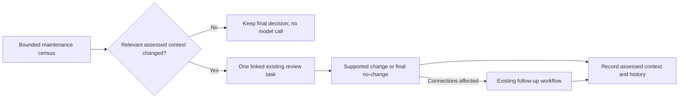

# Final beta work and acceptance plan — 20 September 2026

**Status: approved by Adrian on 20 September 2026; implemented, locally qualified and installed. Beta tag/release awaits the explicit historical-timeout exception.**
[Delivery evidence and criterion dispositions](beta-delivery-20260920.md).
The [master roadmap](ROADMAP.md) remains the status register. Approval covers the
bounded work, QA and conditional RAG publication below; it does not require
another routine approval at each stage.

## Outcome and fixed scope

Ship an inspectable beta that produces useful, evidence-supported results,
retains uncertainty, and revisits settled questions when relevant context changes.
It must converge on unchanged evidence. Every historical interpretation need
not be correct; software must enforce grounding, state, accounting and recovery.

The current main-corpus hour is complete: 638/711 selected tasks resolved,
one failed worker was replaced, policy was restored and verification passed.
Its [retained review](maintenance-final-review-20260920.md) is evidence, not a
requirement to clear the entire backlog before beta.

| Order | Item | Bounded delivery |
|---|---|---|
| 1 | ESC-OPS-06: early Codex deadline | Explain the effective deadline, reproduce and repair any defect, and retain enough timing context to diagnose future failures. |
| 2 | RAG-MNT-006: initial reconsideration | Extend existing maintenance discovery and comparison for previously settled concepts and alias questions, including those no longer selected by sparse/open filters. |
| 3 | ESC-OPS-05: lifecycle guidance | State the existing restore and synonym preconditions consistently in shared prompts and the Scottish action summary. Preserve validation. |
| 4 | Beta qualification and publication | Targeted proofs, one final complete local gate, bounded scratch-corpus acceptance, exact-version installation and a beta release with explicit limits. |

No new task types, statuses, model routes, dependency service or scheduler.
Keep Luna Low for ordinary work, Sol Medium for advanced work and local BGE
embeddings. Semantic prompt tuning, taxonomy changes, global periodic rereview,
database redesign and wider endurance/platform qualification remain separate.

## 1. Diagnose the early deadline before changing policy

The failed request was recorded at 08:02:37.429 UTC and its receipt at
08:02:50.899 UTC: about 13.47 seconds, with a configured 120-second provider
timeout. Exact-turn interruption and worker replacement succeeded; usage is
explicitly incomplete. Authentication or database contention is not established
as its cause.

There is a concrete alternative deadline to investigate. In
`ragapplicationprovider`, the operation allowance is the smaller of provider
timeout and remaining claim lease minus five seconds. `codex_provider` then
shares that allowance across preflight, thread/turn setup and reads. Therefore
120 seconds of configuration does not prove 120 seconds remained at submission.
The retained terminal item no longer contains its original lease deadline.

Reconstruct the claim, lease, operation start, request and failure timeline from
existing records. Trace remaining-time propagation, operation reset and clock
handling; separate waiting from setup and any persistence delay. Make the
smallest repair in the owning module. Retain the effective allowance, limiting
reason, elapsed time and failed phase through existing request/event diagnostics;
no new reporting subsystem. Never substitute a higher timeout or restart limit
for this diagnosis.

**AC-1.** A controlled short-lease case expires at the lease-derived limit and
reports that reason; a healthy response within a sufficient effective allowance
succeeds. Prove both lower and upper timing bounds with tolerances, using short
fixtures. Current noisy/fragmented protocol tests establish an upper bound but
do not adequately reject a premature timeout.

**AC-2.** Preflight/notifications do not renew the allowance; a subsequent healthy
operation does not inherit an expired one. Genuine timeout preserves the exact
attempt/turn, confirmed outcome or uncertainty, known usage and normal worker
replacement. Unknown usage remains unknown; no duplicate submitted call.

**Closure gate:** account for the observed early deadline from evidence or a
controlled reproduction. If retained evidence cannot establish the historical
cause, retain that uncertainty and obtain approval for any beta exception;
an uneventful soak alone cannot close ESC-OPS-06. A CREXX-owned defect is an
upstream blocker requiring its own scoped repair authority, not product-native
workaround code.

## 2. Make reconsideration selective and convergent

`ragbacklog` remains the owner. Use the existing paged census, evidence builder,
task identity, priority/age ordering and successor links. Include previously
settled subjects in bounded census progress even when an alias is closed or a
concept is above the sparse-degree threshold. Comparison does not call a model;
only a materially changed question becomes eligible work.

For this initial version, relevant context means the subject's meaningful state,
direct source mentions/supports and incident claims, plus identities eligible for
the same ambiguity question. Include claim meaning/provenance, not only quoted
text. A remote graph change, timestamp, generic version bump, prompt/model change
or global corpus generation alone is not a reason to reopen. This is a local
dependency boundary, not arbitrary graph-wide inference about relevance.

Keep immutable provider inputs and decisions. Derive or retain the assessed
context alongside existing decision history, accounting for changes made by the
decision itself. Closing an alias, applying a synonym or retaining a concept must
not itself create an endless reconsideration cycle. No new table/schema is
planned; an unavoidable schema expansion would be a scope change to review.

When context changes, enqueue one successor of the appropriate existing kind,
link the prior question, and carry its relevant capability and holds. Discovery
does not overturn the accepted graph: any replacement decision goes through
current validation and publication. Do not bypass a newly discovered ambiguity
by blindly reusing an old occurrence decision. Existing split/merge connection
workflows and alias follow-up extraction remain responsible for reconnecting work.

**AC-3.** Through normal maintenance discovery, new relevant support or a changed
eligible identity reopens a closed alias question and a settled non-sparse
concept. An incident claim change with the same source span is also detected.
Unrelated concepts and unrelated corpus publication are negative controls.

**AC-4.** Repeated unchanged windows and simultaneous discoveries create neither
duplicate successors nor new reasoning calls for the settled question. A final
no-change stays final for that context. The same holds after an applied change
and its required follow-up settle. Paged census reaches later subjects without
rebuilding the entire graph on every dispatch.

**AC-5.** Relevant new work retains explicit history/parent links and existing
advanced routing, deferral, waiver/review, ownership and job/call-budget rules.
Changed evidence cannot bypass a hold or revive an exhausted unchanged task.
Read-only query visits create no tasks and make no model calls. Explicit reset
remains the supported deliberate reconsideration control.

**AC-6.** Alias reuse/distinct and split/merge still schedule their existing
follow-up, preserving directional source support and retirement guards. Test a
completed originating task with an unfinished connection workflow: it must remain
visible as unfinished, without copying every fact onto every successor.

Older records must have a tested upgrade path using retained evidence/history,
without blanket resets or mass reopening solely because metadata is absent.
Questions outside this defined local context remain a documented beta limitation.

## 3. Align the operational action guidance

`ragresolutioncontract` owns the instructions; `ragmaintain` remains authoritative
for lifecycle checks. State that restore needs a retired concept and a synonym
must not collide with another active concept. Keep ordinary, correction,
advanced and public prompt inspection consistent. Align the existing Scottish
operator action summary so it does not contradict the shared contract.

**AC-7.** Prompt captures/inspection contain both rules on every relevant route.
An active restore and colliding synonym are rejected; a valid retired restore
and non-colliding synonym succeed with independent graph/evidence assertions.
This repairs missing operational facts, not all model adherence or semantic quality.

## 4. Test once at the right scope, then release

Before product edits, run the affected existing controls, add failing acceptance
and positive controls, and retain the baseline results. Extend the current
fixtures rather than building another harness:

| Concern | First targeted coverage |
|---|---|
| Deadline/recovery | `codex_protocol` variants, `observability_providers`, affected native Codex/worker recovery journey |
| Reconsideration/follow-up | `durable_backlog`, `durable_backlog_escalation`, `durable_backlog_budget`, source scoping and task-reset controls |
| Action guidance | Prompt inspection/captures and backlog/lifecycle positive and refusal cases |

Then, when implementation is stable:

1. Build once; run the complete required `regression` selection and audit with
   `report.py --require-complete`. The current 132-case inventory is the starting
   point, plus new acceptance. Parallel private fixtures remain the default;
   exact-input passing receipts are reused. No duplicate full suite after a
   documentation-only change, no build over active tests, no disabled failures.
2. Verify the installed candidate in a preserved Scottish **copy**. Run one
   maintenance window, at most **15 minutes / 200 total Codex calls**, four workers,
   local BGE, Luna Low/Sol Medium. Search/read/correction calls count in that cap;
   retain the existing per-call token limits. Use controlled small copy fixtures
   to ensure ordinary and advanced reconsideration are exercised; do not depend
   on chance selection. Fixed deadline, normal draining, no automatic extension.
3. Retain the bounded hosted Gemini regression: at most **four calls / ten
   minutes / USD 1**, on synthetic scratch evidence through existing controls.
   Malformed-output and secret-redaction negatives stay in deterministic tests.
   Missing access or an unmet gate is reported, not substituted with a fake pass.
4. Inspect all failures and up to 12 representative changed/unchanged decisions,
   including both routes and structural follow-up. Pass requires traceable
   source support, justified uncertainty, expected reconsideration and no new
   looping, unsafe publication or accounting defect. Report sample limits; no
   accuracy percentage or requirement to empty the backlog. Verify scratch
   integrity and zero live ownership/reservations at closeout. Do not copy its
   experimental graph changes into the main corpus.
5. Update architecture/user guidance and the diagram, regression coverage,
   refactoring/SQL evidence where affected, and ROADMAP dispositions. Freeze the
   clean source SHA and artifact/runtime hashes. Commit and push the approved
   RAG changes, install that qualified candidate in `~/.local` and the Scottish
   workspace, and smoke-check identity, configuration and read-only retrieval.
   No new maintenance job on the main corpus is implied.
6. Publish the proposed **`v0.1.0-beta.1`** tag/release only after the gates pass.
   Record exact source/artifacts, supported installed platform, dependencies,
   tests and remaining limitations. A release metadata edit does not justify
   repeating unchanged product executions; actual artifact changes invalidate
   the corresponding receipts normally.

**AC-8.** All eight criteria and required tests have linked evidence, the timeout
gate is closed or explicitly waived, installed and published identities agree,
and no unaccepted integrity, recovery, convergence or accounting failure remains.
Historical failed calls and known semantic limitations remain visible.

This is a locally qualified macOS beta. T7-10's historical host-resumption cause,
multi-hour unattended endurance (RAG-QA-01), wider quality/health-and-social-care
acceptance (RAG-QA-02), installed Linux/platform qualification (RAG-QA-03) and
broader adversarial-source qualification (RAG-QA-04) remain explicitly open.
Publication must not describe those as passed. No health/social-care corpus run,
new hour-long soak, CREXX publication or general model experiment is in this plan.

Approval is recorded for this fixed scope through conditional beta publication.
Any additional blocker is reported with its evidence and smallest proposed
change; it does not silently expand the release batch.
