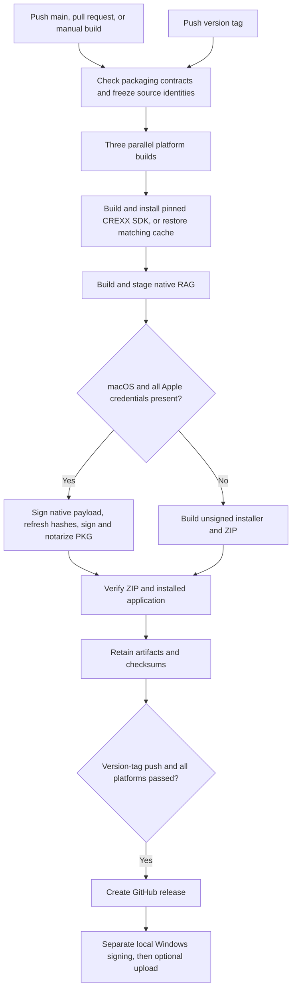

# Builds, installers and signing

The GitHub workflow builds **Windows x64, macOS Apple Silicon and macOS Intel**
in parallel. Each platform produces a portable ZIP and an installer, with
SHA-256 files and an embedded `release.json` inventory. The installer contains
RAG and its required CREXX native runtime; users do not need a separate CREXX
installation. Models, credentials and user libraries are not bundled.

Implementation: [workflow](../.github/workflows/build-release.yml),
[packager](../scripts/release/package.py),
[Windows installer](../packaging/windows/crexxrag.nsi).
The [delivery record](installer-delivery-20260920.md) distinguishes local checks
from hosted platform and real-signing acceptance.

## Build and publication stages



1. Freeze the full RAG checkout SHA and the CREXX SHA in
   [`.github/crexx-revision.txt`](../.github/crexx-revision.txt). Updating CREXX
   is an explicit dependency change. The initial pin is the published runtime
   used by the current local RAG baseline, `5949ef27efd813b8bb96d23c58717b9a72aad1b9`.
2. Build the installed CREXX SDK using its staged targets and explicit llama
   runtime/provider packaging targets. The SDK cache includes platform and
   exact dependency SHA. Bump its recipe version when SDK options change.
   Parser mode is disabled: RAG does not need its separate editor dependency.
   Apple Silicon includes Metal; Intel and Windows use CPU inference. CUDA,
   Vulkan and downloaded model files are outside this installer scope.
3. Build Release RAG against that installed SDK, then stage into a private
   prefix. Package only that prefix, including runtime notices and the CREXX
   licence. Native packaging checks library creation and two child workers.
4. Verify the actual relocated ZIP and installed application: payload and
   provider hashes, library initialization, two-worker supervision and library
   verification. These checks use isolated scratch libraries and no hosted
   model calls. Windows also tests install/reinstall/uninstall, long and absent
   PATH values, an existing PATH entry and preservation of unrelated user files.
5. Upload installable artifacts only after the checks pass. Main, PR and manual
   builds retain workflow artifacts for 14 days. Only a pushed `v*` tag creates
   a GitHub release, after all three platform jobs pass. A version containing
   `-` becomes a prerelease. Tags must match the CMake product version (currently
   `0.1.0`) with an optional prerelease/build suffix; development artifacts use
   `0.1.0-dev.<run-number>`.

These are build/installer gates. They do not replace the required local
functional regression gate or qualify hosted providers on every platform.
The current hosted build disables the platform-specific functional test fixtures
and runs the separate packaging/native smoke checks above. Wider platform
regression remains RAG-QA-03. A release tag is a maintainer publication decision;
this workflow does not create tags or decide whether outstanding defects are
acceptable. The beta decision recorded in the roadmap remains independent.

## macOS signing: optional until configured

Both `.pkg` and ZIP are created when credentials are missing. They are named
`*-unsigned.*`; the log and GitHub summary list missing **setting names only**.
Partial configuration also skips the entire signing/notarization path. Once all
nine settings are populated, any invalid credential, signing or notarization
failure fails the job instead of silently producing an unsigned success.

Create these **repository Actions secrets**, matching CREXX's names:

| Secret | Value |
| --- | --- |
| `APPLE_DEVELOPER_ID_CERTIFICATE_BASE64` | Base64 Developer ID Application `.p12`, including its private key |
| `APPLE_DEVELOPER_ID_CERTIFICATE_PASSWORD` | Password for that `.p12` |
| `APPLE_DEVELOPER_ID_IDENTITY` | Full Developer ID Application signing identity |
| `APPLE_DEVELOPER_ID_INSTALLER_CERTIFICATE_BASE64` | Base64 Developer ID Installer `.p12`, including its private key |
| `APPLE_DEVELOPER_ID_INSTALLER_CERTIFICATE_PASSWORD` | Password for the installer `.p12` |
| `APPLE_DEVELOPER_ID_INSTALLER_IDENTITY` | Full Developer ID Installer signing identity |
| `APPLE_ID` | Apple developer account email |
| `APPLE_APP_SPECIFIC_PASSWORD` | App-specific password for notarization |
| `APPLE_TEAM_ID` | Developer team identifier |

Only main and version-tag builds receive these credentials. Pull requests,
including same-repository PRs, and manual builds of other branches build unsigned.
GitHub supplies an empty value for an unset secret; the packager checks the
effective environment rather than assuming every secret exists.
[GitHub secret behavior](https://docs.github.com/en/actions/how-tos/write-workflows/choose-what-workflows-do/use-secrets).

Signing imports credentials into a private temporary keychain, signs the native
executable and runtime libraries with hardened runtime and timestamps, verifies
them, and refreshes the provider's nested runtime hashes. It then signs the PKG,
submits it to Apple and waits for acceptance, staples the ticket and validates
it. The private keychain is removed on success or failure. `*-signed.zip`
contains the same signed payload; the **PKG** is the notarized/stapled delivery
container. [Apple notarization workflow](https://developer.apple.com/documentation/security/customizing-the-notarization-workflow).

The PKG installs under `/usr/local/lib/crexxrag` with a
`/usr/local/bin/crexxrag` symlink and requires administrator installation.
Portable ZIP users can extract into their own folder and invoke `bin/crexxrag`.
Unsigned downloads may require explicit approval in macOS Privacy & Security;
unsigned output is not represented as Developer ID signed.

## Windows: separate post-release signing

CI always produces `*-windows-x64-unsigned.zip` and `*-unsigned-setup.exe`.
The NSIS installer is per-user under `%LOCALAPPDATA%\Programs\crexxrag`, adds
its `bin` directory to the user PATH and registers an uninstaller. It neither
sets `CREXX_HOME` nor changes a separate CREXX installation. Reinstallation
avoids duplicate PATH entries. Uninstallation removes only packaged files and
its own PATH addition; unrelated files and pre-existing PATH entries remain.
Restart the terminal after installation to receive the new PATH.

The maintainer runs [the separate signing script](../scripts/sign-windows-release.sh)
on their signing machine, following CREXX's PKCS11 workflow. Requirements:
Python 3.11+, NSIS (`makensis`), `jsign`, `osslsigncode`, the local token/provider,
and `gh` only when uploading. Set `PROVIDER` to the PKCS11 configuration and
`CERTUM_ALIAS` to the token identity; `TSA_URL` optionally overrides the existing
Certum timestamp service. Credentials stay on that machine.

```sh
# Download the unsigned ZIP for the chosen release and verify its SHA-256 file.
scripts/sign-windows-release.sh \
  --zip /path/to/crexxrag-0.1.0-beta.1-windows-x64-unsigned.zip \
  --output /path/to/signed-assets

# To sign and upload in one invocation, also supply:
# --upload --repo adesutherland/crexx-rag --tag v0.1.0-beta.1
```

The script verifies the input inventory and provider hashes before signing. It
retains already valid vendor signatures and signs remaining PE executables/DLLs
and PowerShell helpers, updates the provider runtime
manifest before the enclosing native manifest, and rebuilds the release inventory.
It signs private NSIS helper DLLs, the generated uninstaller and final installer,
and verifies the signatures with `osslsigncode`. It writes a new signed ZIP,
installer and checksums; the original unsigned ZIP is unchanged.

There is **no upload by default**. `--upload` first checks that the chosen tag
resolves to the payload's exact RAG source SHA. Signed assets use different names
and do not overwrite the unsigned assets. On an interrupted upload, keep the
completed signed outputs and retry their `gh release upload` after inspecting
the remote assets; do not rebuild or re-sign merely to retry transport. Real
token signing and signed Windows execution still require their first acceptance
run; simulated signing tests are not certificate-validation evidence.

## Local packaging checks

```sh
python3 tests/release/test_packaging.py
actionlint .github/workflows/build-release.yml
shellcheck scripts/sign-windows-release.sh
# After normal configure/build, the same contract is a fast CTest case:
ctest --preset fast -R '^release_packaging$' --output-on-failure
```

For a development macOS package, stage an already built application with
`cmake --install <build-dir> --prefix <private-prefix>` and invoke
`python3 scripts/release/package.py package` with `--prefix`, `--output`,
`--version`, full `--commit`, full `--crexx-commit` and
`--platform macos-arm64` or `macos-x86_64`. Use an empty output directory per
build. This command checks the effective Apple environment just like CI.
`python3 scripts/release/smoke.py --archive <zip>` verifies and executes the
relocated application using disposable state.

The local Windows script compiler check can run on macOS with NSIS, but only
Windows execution proves installer behavior. The hosted runner matrix uses
[GitHub's platform labels](https://docs.github.com/en/actions/reference/runners/github-hosted-runners).
