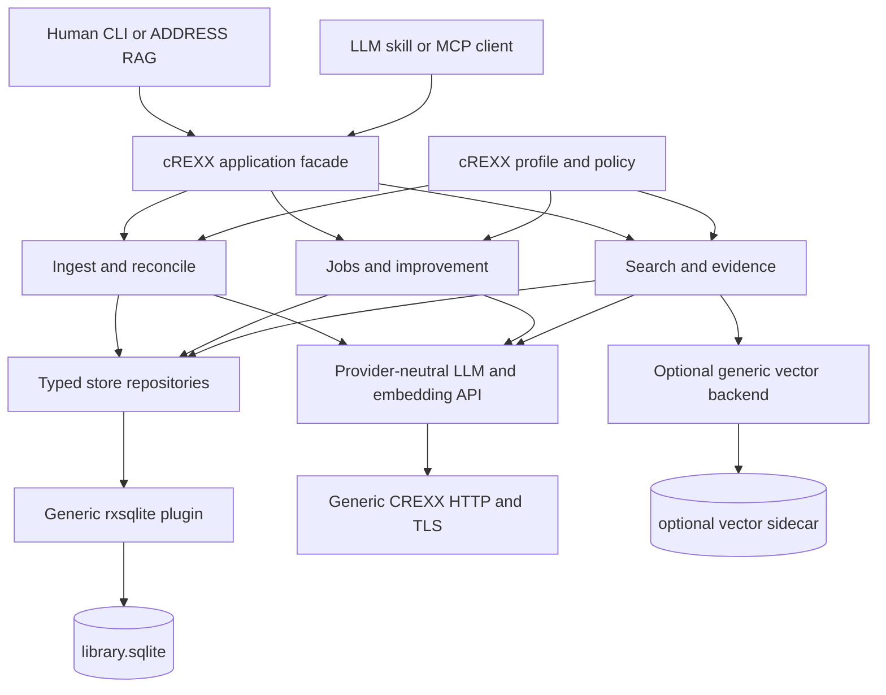
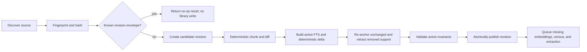
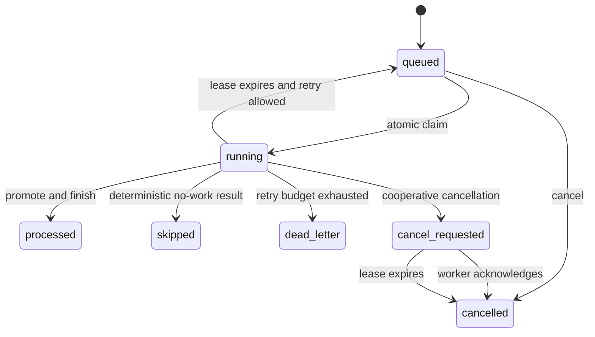
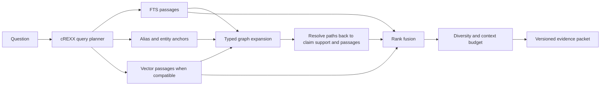

# cREXX-Only Architecture

Status: approved architecture with Phases 2 through 6 implemented and staged,
2026-08-24. Gate 7 rejected/deferred cutover, so the current C++ core remains
the default executable reference while the named provider, worker, comparison,
and Linux gates remain open.

## Architectural Shape

In plain English, one cREXX application owns the knowledge decisions. It reads
and reconciles sources, records evidence, schedules bounded improvement, plans
questions, combines several search methods, and builds the final evidence
packet. SQLite is the durable source of truth. Hashing, HTTP, JSON, and vector
operations are general CREXX facilities underneath it, not a second hidden RAG
implementation.

The application has several thin entrypoints so a human CLI, a cREXX program,
and an LLM agent all invoke the same operations and receive the same typed
results. Shell scripts may start tools, but they do not own the algorithm.



The facade returns typed cREXX records internally. JSON and MCP
`structuredContent` are encodings at process boundaries, not the application's
internal data plane.

## Boundary Rules

1. Application semantics live in `.crexx` modules.
2. Native plugins expose mechanisms, not RAG operations.
3. SQL is owned by cREXX repositories and migrations.
4. Provider adapters return normalized records; providers never write the
   library.
5. Profile modules own domain vocabulary and policy; storage has no Scotland,
   history, or IT-architecture special cases.
6. CLI, `ADDRESS RAG`, and MCP call the same facade methods.
7. Read operations open the store read-only and have a zero-write contract.
8. Long work returns a job identifier; it never depends on a live terminal.
9. The current native path and the new path do not dual-write a production
   library.

## Application Modules

Names are provisional, but ownership is not.

| Module | Responsibility |
| --- | --- |
| `ragmodel` | Typed records, identifiers, state enums, validation errors, invariant helpers |
| `ragconfig` | Declarative cREXX config modules, environment references, effective-config snapshots |
| `ragprofile` | Domain vocabulary, aliases, cue rules, weights, prompts, validation and routing contract |
| `ragstore` | Connections, migrations, repositories, transaction boundaries, pagination |
| `ragsources` | Source discovery, fingerprinting, revision planning, connector normalization |
| `ragchunk` | Plain, Markdown, and Rexx-aware deterministic chunking and stable spans |
| `ragcensus` | Candidate extraction, normalization, corpus/delta collation, adjudication |
| `ragclaims` | Concepts, aliases, ambiguity, typed claims, support promotion/retraction |
| `ragqueue` | Job plans, work items, leases, attempts, budgets, retry and status |
| `ragproviders` | Role routing and normalized chat, structured-output, and embedding calls |
| `ragimprove` | Coverage analysis, extraction scheduling, fixup and review producers/consumers |
| `ragsearch` | Query planning, lexical/vector/graph retrieval, fusion and evidence selection |
| `ragevidence` | Stable citations, evidence packet schema, trace and optional answer handoff |
| `raglibrary` | Level G public API and library/job/evidence classes |
| `ragcommand` | Closed argv request grammar and bounded typed human/JSON/NDJSON result contract |
| `ragfoundation` | Shared doctor, lifecycle, provider-diagnostic, and profile-validation dispatch |
| `ragcli` | Human and JSON command adapter |
| `ragaddress` | `ADDRESS RAG` line-command adapter |
| `ragmcp` | MCP schema and transport adapter, read-only by default |

Level G owns product algorithms, repositories, providers, orchestration, jobs,
profiles, and advanced reusable libraries as well as the public object surface.
It may import Level-B foundation libraries such as binary, JSON, HTTP, or other
CREXX bootstrap facilities directly. Level B is not an application optimization
tier: it is reserved for CREXX foundation implementation or an explicitly
measured low-level mechanism that Level G cannot express. Facades exist only
where they define a stable public contract, not to cross language levels. A
module moves to the common CREXX libraries only after its API is demonstrably
domain-neutral.

## Generic Capability Incubation

Generic components may live under a clearly separated incubation tree in this
repository, for example `incubator/crexx/`, until they are ready to donate.
They must be independently buildable/testable and must not import `rag*`
modules. Each implemented donation-candidate directory must contain a user
`README.md` and maintainer `SYSTEM.md` beside the source and must be classified
in the [incubation audit](../incubator/README.md). Documentation completeness
does not itself authorize donation.

### `rxsqlite` required contract

The sister repository's current SQLite address demo is not a usable foundation:
it is a single-connection, fixed-buffer, text-shaped demonstration and is not
installed as a development/runtime plugin. The target plugin needs:

- read-only, read-write, and create connection modes;
- multiple connection handles with deterministic close/finalization;
- prepared statement handles;
- named and positional binding for null, integer, real, text, and blob;
- typed column access and cursor/page iteration;
- explicit transactions and savepoints;
- busy timeout, WAL mode, checkpoint, and concurrency diagnostics;
- FTS5 and JSON1 capability reporting;
- online backup, integrity checks, and foreign-key checks;
- structured errors including SQLite code, extended code, operation, and safe
  message; and
- no fixed whole-result buffer or pipe-delimited row encoding.

`ADDRESS SQLITE` is a useful line-command facade over this API. It is not the
repository layer: application code should retain typed handles and iterate
rows without serializing through text.

### Structured data

The current `rxjson` helper reparses a JSON string for each path lookup. That is
unacceptable as the new internal record transport. The programme should
incubate or consume a parse-once document/value handle aligned with CREXX
performance capability CAP-01. It needs array/object iteration, typed values,
correct Unicode, explicit missing/null/empty distinctions, and bounded encoding.

The application still prefers typed cREXX records for its own calls. Parsed
JSON is required for provider and MCP boundaries, not as a substitute for an
application object model.

### LLM and embedding providers

The existing Level G CREXX provider library is the starting point: it already
demonstrates local Ollama and hosted OpenAI, Anthropic, and Gemini access over
cREXX HTTP. Extend it as a generic `rxllm` library/plugin package behind one
capability-oriented contract:

```text
provider.capabilities()
provider.generate(request)
provider.generateStructured(request, schema)
provider.embed(request)
provider.embedBatch(requests)
provider.cancel(request_id)
```

Normalized request records include role, model, messages/input, schema, timeout,
retry policy, privacy class, and idempotency key. Normalized results include
provider/model identity, content or vectors, finish reason, usage, latency,
request id, and retry/error classification.

Support these provider shapes without spreading vendor logic into the pipeline:

- local llama.cpp `llama-server` using an OpenAI-compatible base URL;
- local Ollama;
- hosted OpenAI-compatible endpoints;
- hosted OpenAI, Anthropic, and Gemini adapters where their protocols differ;
  and
- a deterministic fake provider for tests.

Connection reuse, streaming, cancellation, structured output, compression,
rate-limit handling, and bounded response assembly are capability work for the
generic HTTP/provider layers.

The Phase-1B incubation now implements the provider-neutral records, a dated
model/cost/capability catalog, configurable local OpenAI compatibility, and
distinct OpenAI Responses, Anthropic Messages, and Gemini generation/embedding
payloads. It covers structured output, ordered batch embedding, bounded retry,
usage/cost records, URL media modalities, pre-transport privacy denial, and
secret-free evidence. This remains an incubation rather than the shipped
`rxllm` package. The current installed generic HTTP surface now supplies typed
bounded responses, connection-owner pooling, compression, streaming and
cancellation primitives with upstream Linux sanitizer/cross-platform evidence,
and the downstream macOS inventory passes against it. CRI-15 remains an exact
downstream Linux confirmation gate. CRI-16 now withholds a provider-lifetime
reuse claim until the adapter lifecycle is approved and proved; provider
streaming and cancellation remain explicit separate capabilities.

Phase 7's bounded external OpenAI run passes structured generation plus a
two-input 128-dimensional batch embedding. The equivalent cREXX provider probe
still loses response completion, so the run qualifies hosted availability and
request shapes, not the cREXX adapter, cross-operation pool reuse, or a product
`.ragworkprovider`.

### Hash and binary data

Stable source identity requires SHA-256 or an equivalent collision-resistant
digest over bytes. FNV and MD5 are not sufficient for durable content
identity. The installed `rxhash` provider now supplies one-shot binary digests,
canonical lowercase hexadecimal output, immutable incremental state, and
synchronous bounded-memory file hashing. The public family is:

```text
rxhash.sha256(data = .binary) = .binary
rxhash.sha256hex(data = .binary) = .string
rxhash.sha256init() = .binary
rxhash.sha256update(state = .binary, data = .binary) = .binary
rxhash.sha256final(state = .binary) = .binary
rxhash.sha256finalhex(state = .binary) = .string
rxhash.sha256file(path = .string) = .binary
rxhash.sha256filehex(path = .string) = .string
```

The 32-byte raw and 64-character lowercase hexadecimal forms hash arbitrary
binary input. Incremental state is the provider's validated, canonical,
pointer-free 152-byte version-1 value and is safe to copy or transfer. The
application's `ragfile.sha256filebounded` foundation keeps its own byte ceiling
and byte count while feeding fixed chunks through that immutable state; it
does not accumulate a whole file. Direct file routines remain appropriate when
the caller does not need that extra policy boundary.

Embedding storage should use a versioned float32 blob codec. The first vector
PoC must measure SQLite transfer/decoding separately from similarity arithmetic.
Pure cREXX exact cosine/top-k is a credible small-library baseline; a generic
native vector/ANN backend is added only if the representative corpus proves it
necessary.

Phase-1B measurement confirms exact, deterministic, bounded-page cREXX search
but reports 750,316 to 857,843 us total for the retained 11,684-by-768 shape,
with arithmetic dominating and process RSS below 64 MiB. Exact cREXX remains
the correctness fallback. The separately authorized generic `rxvector`
qualification subsequently selected and implemented a stateless exact CPU
provider over packed native values; the installed bounded replay totals
122,740-129,974 us with exact results. No SQLite vector extension, FAISS
dependency, persistent handle, or ANN backend is selected by this result.

## Library Bundle And Manifest

```text
library.cprag/
  manifest.json
  library.sqlite
  vectors.<generation>.faiss       # optional, rebuildable
  snapshots/                       # optional operator-created backups
```

The manifest contains only non-secret, externally useful facts:

- bundle format and schema versions;
- library UUID and creation/update timestamps;
- active profile id and hash;
- active source and index generations;
- embedding profile/provider/model/dimension fingerprints;
- required feature/capability versions;
- active immutable sidecar checksums; and
- whether a migration or recovery is pending.

The manifest is a recoverable projection of a generation already committed in
SQLite, not a checksum of the continuously changing live database. Publication
orders operations as follows: create and validate immutable sidecars, commit
their identity plus the new semantic generation in SQLite, then publish a new
manifest with write-to-new plus atomic rename. A crash may leave the manifest
behind SQLite but never legitimately ahead of it. Read-only open uses the
database generation, reports a stale manifest, and performs no repair; an
authorized recovery rewrites the projection. Vector sidecars are rebuildable
artifacts.

## Schema Version 2

The exact DDL belongs to the storage worklist. These logical tables and
identities are required.

### Library and configuration

| Table | Essential identity and purpose |
| --- | --- |
| `schema_migrations` | ordered version, checksum, applied time/tool version |
| `library_meta` | library UUID and current published generation |
| `published_generations` | immutable semantic generation, parent, state, configuration and publication time |
| `config_snapshots` | effective non-secret config/profile hash used by work |
| `provider_runs` | normalized model request identity, usage, timing, outcome |

Every row that affects query-visible source, FTS, mention, claim, support, or
index state is either bound to an immutable generation or has explicit
`visible_from_generation` and `visible_to_generation` bounds. Staging rows are
not visible. A reader starts a SQLite read transaction, pins
`library_meta.published_generation`, and filters all repositories to that same
snapshot. One short SQLite transaction activates the new source revisions,
visibility bounds, FTS projection, support state, and generation pointer, so a
reader sees wholly the old or wholly the new semantic state. Job progress and
events are operational rows and may advance without changing that semantic
generation.

### Source lifecycle

| Table | Essential identity and purpose |
| --- | --- |
| `sources` | stable source id, connector type/stable key, current revision, lifecycle state; URI/title are observations |
| `source_artifacts` | immutable raw bytes or verified external artifact reference, raw digest, MIME and encoding |
| `source_revision_texts` | mandatory captured normalized UTF-8 text/digest and extractor/normalization version |
| `source_revisions` | source id + revision-envelope digest, raw/text artifacts, semantic metadata fingerprint and capture/event time |
| `normalization_maps` | raw byte to normalized UTF-8 byte/line/Unicode-column mapping for evidence spans |
| `chunk_contents` | immutable text/content digest used for safe derived-work reuse |
| `revision_chunks` | revision occurrence, ordinal/span, content id, logical continuity key, parser version, evidence class |
| `chunks_fts` | FTS projection for active revision-chunk occurrences |

Chunk identity has two layers. A citation identifies an immutable source
revision occurrence, for example
`cprag://<library-uuid>/<source-id>@<revision-id>#b<start>-<end>`, never a
mutable URI or transient SQLite row number. Canonical spans are normalized UTF-8
byte offsets; display records also carry line and Unicode-scalar columns plus a
map to captured raw bytes. A separate text/input fingerprint lets unchanged
content reuse embeddings and reviewed analysis across revisions when every
relevant envelope field also matches. Rechunking may create new occurrences;
the citation resolver still maps historical revision/span citations exactly.

Connector stable keys, not content hashes, establish logical source identity.
Identical files may therefore be distinct sources. Rename preservation is
automatic only when the connector supplies a stable id or an explicit approved
mapping; otherwise the plan reports remove-plus-add. A revision-envelope digest
combines the raw/normalized content identity with semantic provenance/time
metadata, so a metadata-only change creates an immutable new revision without
duplicating the underlying artifact.

### Candidates and concepts

| Table | Essential identity and purpose |
| --- | --- |
| `candidate_mentions` | normalized candidate + chunk/span + extractor version |
| `candidate_decisions` | versioned adjudication with state, evidence and model/policy provenance |
| `concepts` | stable canonical concept id, type and lifecycle state |
| `aliases` | normalized alias, target or ambiguity set, decision provenance |
| `mentions` | concept/ambiguity to chunk/span evidence; weak support only |

### Claims and support

| Table | Essential identity and purpose |
| --- | --- |
| `claims` | source concept + relationship type + target concept + direction, qualifiers and effective validity interval |
| `claim_support` | claim + revision/chunk/span + polarity, stance/directness, attribution, lineage/independence group and extractor/decision identity |
| `claim_conflicts` | competing or incompatible claim set and review state |
| `ambiguity_candidates` | explicit ambiguity node to possible concept with evidence |

A display label is not part of claim identity. Support has a uniqueness key so
replay is a no-op. Support polarity distinguishes support from contradiction;
stance distinguishes direct assertion, attributed quotation/report, negation,
and speculation. Attribution identifies who is presented as making the claim.
Captured/system time and asserted/effective validity are separate. Provenance
lineage prevents syndicated or duplicated sources from being counted as
independent corroboration. A versioned cREXX policy derives claim state and an
explainable confidence breakdown from active independent support,
contradictions, source confidence, stance, directness, and review decisions; it
is not an opaque last-writer-wins probability.

### Embeddings and indexes

| Table | Essential identity and purpose |
| --- | --- |
| `embedding_profiles` | provider/model/dimension/input-envelope fingerprint |
| `embeddings` | embedding input digest + profile, vector blob and request provenance; revision occurrences reference reusable results |
| `vector_generations` | immutable build generation, profile, state and checksum |

Multiple profiles may coexist. Index publication is atomic: build a new
generation, validate it, then switch the manifest/database pointer. A stale or
dimension-mismatched generation is rejected, and automatic search falls back
to lexical/graph retrieval.

### Jobs and review

| Table | Essential identity and purpose |
| --- | --- |
| `jobs` | applied canonical plan/digest/config plus aggregate state, reservations and budgets |
| `job_items` | item identity, type, state, priority, worker, lease, monotonic fencing token, retry schedule, idempotency key |
| `attempts` | worker, input/output hashes, provider run, validation and outcome |
| `job_events` | append-only progress/error/state history |
| `reviews` | ambiguity/conflict/type/endpoint/external proposal and decision |
| `runtime_instances` | controller/worker parentage, host/PID/start token, state/control request and database-clock heartbeat; operational only |

Large model outputs may be stored as bounded artifacts or blobs with hashes,
rather than copied into every event. Public status reads aggregates and paged
events through the repository API.

## Source Reconciliation

Initial load and add-documents are one algorithm with different expected
deltas.



Planning stops before `Create candidate revision`. The plan reports source
adds/changes/removals, affected active chunks, estimated provider calls/tokens,
privacy routes, and backup requirements.

Publication must not expose a half-reconciled active revision or stale support.
It does not wait for remote/model improvement work: deterministic chunks, FTS,
support re-anchoring/retraction, and derived-work invalidation are published
together, then missing embeddings/census/extraction continue as observable jobs.
This can use one transaction for small deltas or a shadow generation plus final
pointer switch for large work. Interrupted candidate revisions remain resumable
or discardable, and search reports incomplete derived coverage explicitly.

Incremental invalidation is dependency-driven, not limited to the changed
chunks. Corpus rarity, source diversity, candidate decisions, extraction ranks,
and graph coverage may change when one source changes. Their inputs have
versioned fingerprints and explicit dependency records. A planner reuses work
whose complete input fingerprint is unchanged, invalidates the bounded affected
set, and records why. Replanning the same semantic generation/config/profile
must converge to the same plan and create no new work after completion.

## Candidate And Extraction Pipeline

The target retains the proven stages as internal algorithm names, but ordinary
users see ingest/improve jobs rather than stage numbers.

1. **Census:** deterministic patterns, known aliases, and optional cheap model
   advice produce mentions with exact supporting spans.
2. **Collation:** group by normalized form across the active corpus or source
   delta; calculate count, source diversity, evidence class, prior decisions,
   and ambiguity signals.
3. **Adjudication:** decide keep/junk/ambiguous/type/alias using representative
   evidence passages. Failed parses stay retryable.
4. **Mention promotion:** materialize canonical/ambiguity nodes and weak
   evidence links idempotently.
5. **Extraction ranking:** prioritize direct narrative chunks with useful
   concept density, type diversity, relationship cues, rare concepts, bridges,
   novelty, and unresolved risk; penalize indexes, captions, duplication, and
   low-quality shapes.
6. **Deep extraction:** route the shortlist to a configured provider and obtain
   normalized node/claim proposals.
7. **Validation:** verify type vocabulary, canonical endpoints, evidence span,
   direction, confidence, source/profile scope, and non-overwrite rules.
8. **Promotion or review:** transactionally add support, or enqueue a typed
   review item with the rejection reason.

The ranking formula lives in a cREXX profile and is versioned with each queue.
The current native formula is a baseline fixture, not a permanent universal
formula. Its first cREXX port should reproduce the current generic terms before
changing weights, then add independently visible novelty, redundancy, bridge,
and source-quality terms. Every queued item stores the component values so a
human or agent can explain why model work was selected.

Normalized extraction proposals contain a proposal id, node or claim kind,
canonical endpoint references, proposed types, relationship direction,
confidence, exact evidence span, provider/model request id, prompt/schema
version, and source/profile scope. Tagged local-model output may remain a robust
wire encoding, but it is parsed immediately into this typed record and never
becomes graph state directly.

## Durable Work And Overnight Improvement

Phase 4 first proved one process, then qualified multiple competing OS-process
workers through database-clock leases, SQLite writer serialization, monotonic
fences, forced termination, expiry, and late-worker rejection. In-process cREXX
thread safety is not assumed; concurrency is process-based.

Gate 3R adds a separate runtime coordination plane. `runtime_instances` stores
controller/worker parentage, host, PID, random process-start token, executable
identity, mode/job filter, state/control request, current item and database-
clock heartbeat. Every process owns its SQLite connection. Heartbeat expiry is
the liveness authority; same-host PID checks are diagnostic and remote PID
checks are not attempted. This registry never replaces the item lease/fence
state below. Multiple controllers may supervise independent worker groups.



This diagram is the item lifecycle. Job states are `planned`, `queued`,
`running`, `paused`, `cancel_requested`, `cancelled`, `completed`,
`completed_with_errors`, and `failed`. Public counters use `planned_total`,
`queued`, `running`, `processed`, `skipped`, `dead_letter`, `cancelled`, and a
separate failed-attempt count; `failed` in the job state means a job-level
invariant or system failure, not merely one exhausted item.

Claiming uses a short transaction, an atomic state predicate, the database clock,
and a monotonically increasing fencing token. Lease renewal/heartbeat verifies
the worker, attempt, and token. Each work item has a semantic idempotency key.
Provider calls occur outside the claim transaction. Promotion requires the
still-current fencing token and writes accepted support plus final attempt state
atomically. A late worker after lease expiry or cancellation cannot promote.
A crash after the provider call may repeat the call unless a provider
idempotency key is supported, but it may not duplicate graph facts.

Improvement planners create work only for explicit conditions:

- active chunks missing the selected embedding profile;
- candidate deltas without a current decision;
- high-value unprocessed extraction chunks;
- weakly supported or conflicting claims;
- unresolved aliases, types, or endpoints;
- changed profile/prompt/model versions selected for re-evaluation;
- graph coverage or bridge candidates; and
- operator- or agent-requested review.

Item and request-count budgets are hard ceilings. Before a provider call, the
worker reserves the configured maximum tokens/cost and a worker slot; admission
fails when the reservation would exceed the budget. Actual provider usage
releases the difference. Time, token, and cost budgets may exceed the threshold
only by the documented bounded maximum of already admitted in-flight calls,
whose output/token limit and timeout are themselves capped. Status reports both
reserved and actual usage.

Applying a plan only enqueues a durable job. Workers are explicit processes:

```text
crexx-rag worker start [--count N] [--job ID]
crexx-rag worker run --once|--follow [--id ID] [--job ID]
crexx-rag worker list [--local] [--state STATE]
crexx-rag worker status ID
crexx-rag worker drain ID
crexx-rag worker prune --stale-seconds N
```

`worker start` uses the public cREXX child-process channel and waits while its
children run; another application instance reads status through SQLite.
Independently started `--follow` workers may instead run under launchd,
systemd, or a container service. Graceful stop ceases new claims, marks
`cancel_requested` when asked, and finishes or checkpoints the current item;
forced termination recovers through lease expiry and fencing. Recurrence belongs
to the supervisor or an explicit cREXX scheduler module that invokes a
pre-authorized named plan/budget. Scheduling never grants broader library,
source, or provider capability.

## Retrieval And Evidence Assembly

Search is a graph-to-evidence process, not three unrelated result lists.



### Query planning

Planning is deterministic first. It tokenizes and preserves exact phrases,
resolves known aliases, detects time/comparison/relationship intent, and creates
a small set of focused queries. A configured advisory model may suggest
additional variants, but the original question and deterministic variants are
always retained.

### Retrieval channels

- **Lexical:** SQLite FTS5 over active chunks, with phrase and prefix behavior
  explicit in the trace; profile aliases and corpus term statistics may expand
  keywords without losing the original exact query.
- **Vector:** compatible active embedding profile only; used for semantic
  recall, redundancy, and bridge discovery.
- **Graph:** directed, typed paths from resolved concepts and retrieved chunk
  mentions to claims and their support passages.
- **Timeline:** source/chunk event and capture time filters and ordering.

### Fusion

Start with reciprocal-rank fusion because it combines incomparable channel
scores predictably and can be tested without calibration data. Add profile
weights, directness, source confidence, path confidence, hop decay, evidence
class, and recency as explicit cREXX terms. Preserve each component in a query
trace. Learned or calibrated fusion is a later option backed by a judgement
set, not an undocumented replacement.

The initial transparent baseline is:

```text
rrf(item) = sum(channel_weight / (rrf_k + channel_rank))

graph_path = anchor_score
           * path_confidence
           * relationship_weight
           * support_confidence
           * hop_decay ** hops

final = rrf
      + graph_path_boost
      + directness_bonus
      + temporal_relevance
      + source_quality
      - duplication_penalty
```

`rrf_k`, channel weights, relationship weights, hop decay, modifiers, and
context/diversity budgets are versioned profile policy. The trace retains both
the pre-modifier channel ranks and every applied term; corpus judgement tests,
not intuition alone, select later changes.

Vector similarity and co-mention links can increase retrieval priority but
cannot enter `accepted_claims`.

### Evidence packet schema

The primary `ragevidence` result contains:

```text
schema_version
library_id and active_generation
original_question
query_plan[]
passages[]
  citation, source, revision, span, title, text
  source_type, confidence, captured_at, event_start_at, event_end_at
  evidence_class, directness, retrieval_channels[], scores
accepted_claims[]
  subject, relationship_type, object, direction, confidence
  effective_start_at, effective_end_at, asserted_at
  support_citations[] with polarity, stance, attribution, lineage
  confidence_breakdown, conflicts[]
ambiguities[]
graph_leads[]
  path, reason, supporting_mentions[], limitations
gaps[]
trace_id
answer_guidance
optional_generated_answer
```

MCP emits this as typed `structuredContent`; CLI `--format json` emits the same
versioned schema. Human output is only a rendering. `query answer` and
`knowledge_answer` first create exactly this evidence packet, pass it to the
configured optional `answerer`, and return both the unchanged packet and prose.
When no answerer is configured, callers use `query evidence` or their own LLM;
answer generation never changes retrieval or claim state.

### Implemented Phase-5 shape

The Level-G development implementation now follows this design through
`ragquery`, `ragembedding`, `ragretrieval`, and `ragevidencejson`.
`ragquery` emits `crexx-rag.query-plan/1`; `ragembedding` publishes immutable
`crexx-rag.rxvector-generation/1` `.rxvec` sidecars over installed packed
`rxvector`; `ragretrieval` combines bounded FTS5, exact vectors and directed
graph-to-support expansion; and `ragevidencejson` emits bounded
`crexx-rag.evidence/1`, `crexx-rag.retrieval-result/1` and
`crexx-rag.answer-context/1` projections.

Stable citations are canonical strings of the form
`crexx-rag:<library-id>:<source-id>:<revision-id>:utf8-<start>-<end>` and resolve
against the immutable cited revision. Incompatible vector generation,
dimension, manifest, or scan ceiling produces a declared lexical fallback.
The nine frozen IT/Scotland judgements pass the permanent four-cell matrix;
the exact retained evidence and hosted-quality boundary are in the
[Phase-5 record](evidence/2026-08-23-phase5/README.md). Phase 6 freezes the
transport-neutral `ragproduct` request/result facade and the CLI, ADDRESS RAG
and MCP adapters described below; its retained proof is the
[Phase-6 record](evidence/2026-08-24-phase6/README.md).

The Phase-1B scratch algorithm profile preserves semantic parity but crosses
the provisional 10,000-us trigger for 2,000 fixture fingerprint/chunk
operations on both VMs. This is a recorded production-boundary limitation, not
permission to move source identity or chunking policy into product-specific
native code. Durable hashing and any acceleration require separate approval
and measurement.

## Public Surfaces

### Level G API

The authoritative programmatic surface should resemble:

```text
.raglibrary.open(path, access, config)
.raglibrary.status()
.raglibrary.planIngest(source_set, options)
.raglibrary.apply(plan, expected_digest)
.raglibrary.search(query, options)
.raglibrary.evidence(question, options)
.raglibrary.answer(question, options)
.raglibrary.trace(query, options)
.raglibrary.path(source, target, options)
.raglibrary.timeline(options)
.raglibrary.planImprove(options)
.raglibrary.planProposals(input, options)
.raglibrary.review(filter)
.raglibrary.close()

.ragjob.status()
.ragjob.events(cursor, limit)
.ragjob.pause() / resume() / cancel()

.ragevidence.passages()
.ragevidence.claims()
.ragevidence.leads()
.ragevidence.trace()
```

Concrete syntax must follow the cREXX object model and is frozen through a
compiled usage test, not by this illustrative listing.

### CLI

Global options precede the noun/verb:

```text
crexx-rag --library PATH --config ID --profile ID \
          --format human|json|ndjson \
          --access CAPABILITY[,CAPABILITY...] \
          <noun> <verb> [options]
```

Planning performs zero library or managed-state writes. It emits canonical plan
JSON, a content digest, and a suggested expiry; the caller may explicitly save
that output. The content-addressed pair is the review authority. Apply receives
the plan plus the reviewed expected digest,
treats every field as untrusted, verifies the digest, and revalidates library
generation, expiry, config/profile hashes, source fingerprints, provider privacy
routes, reservations, and capability before storing it with the new job. If
anything changed, the user must re-plan. An agent may select only preconfigured
config/profile ids; it may not supply an arbitrary executable module path.

All list operations use cursors. Corpus-scale data is never returned in one
fixed buffer.

### `ADDRESS RAG`

Line commands use the same dispatcher and typed result objects:

```text
LIBRARY OPEN, LIBRARY STATUS, LIBRARY VERIFY,
QUERY SEARCH, QUERY EVIDENCE, QUERY ANSWER, QUERY TRACE,
QUERY PATH, QUERY TIMELINE,
INGEST PLAN, INGEST APPLY,
IMPROVE PLAN, IMPROVE APPLY,
PROPOSAL PLAN, PROPOSAL APPLY,
JOB STATUS, JOB EVENTS, JOB PAUSE, JOB RESUME, JOB CANCEL,
REVIEW LIST, REVIEW SHOW, REVIEW DECIDE,
LIBRARY CLOSE
```

`LIBRARY OPEN/CLOSE` bind and release an address-environment session; they map
to the CLI's explicit `--library` target rather than creating different product
operations. Every other noun/verb maps one-for-one to the facade and CLI and is
covered by shared contract tests.

The safe argv/stem form of `ADDRESS COMMAND` already available in CREXX should
be used for external processes when a provider helper genuinely requires one;
source or prompt text must not be interpolated into shell commands.

### MCP and skills

Read-only startup advertises status, source, search, evidence/optional answer,
path/trace/timeline, and job-status/events tools. A separate non-mutating `plan`
capability advertises ingest/improve/proposal plan and review-list tools for
preconfigured source sets and profiles, including non-mutating review-decision
preview. `diagnose` may advertise library verify
and provider status/test. Write capabilities add ingest/improve/proposal apply,
job control, and review-decision tools as specifically configured, never raw SQL
or raw graph mutation. `apply` enqueues a previously validated plan rather than
performing an unbounded synchronous job. MCP plan results include the canonical
plan payload and digest; apply receives both, verifies the reviewed digest, and
performs the same untrusted-input revalidation as the CLI.

The generic agent instructions are in
[`../prompts/crexx-rag-agent-AGENTS.md`](../prompts/crexx-rag-agent-AGENTS.md).
Package them through narrow skills rather than one all-powerful agent:

| Skill | Default capability | Purpose |
| --- | --- | --- |
| `crexx-rag-qa` | read | focused multi-query evidence and source-bound answers |
| `crexx-rag-ingest` | plan/read; apply only when enabled | source diff, privacy/cost review, job launch and monitoring |
| `crexx-rag-improve` | plan/read; apply only when enabled | bounded background plan, job monitoring and exact closeout |
| `crexx-rag-diagnose` | read/diagnose only | installation, integrity, provider, job and retrieval traces |

Each skill declares the tool/schema versions it expects, checks status first,
and fails closed when a required public tool is unavailable. Skills never gain
write authority merely because they know the apply workflow. The MCP tools also
remain usable without these particular skill packages.

## Configuration Architecture

Three scopes stay separate:

1. **Bundle manifest:** identity and published artifact state; no secrets or
   mutable operator preferences.
2. **Operational cREXX config module:** providers, role routing, privacy,
   budgets, workers, source sets, and schedules. It may construct typed config
   data but has no ingestion/provider side effects. Secret references use
   `env:NAME`.
3. **Typed cREXX profile:** domain vocabulary, aliases, chunk policy, candidate
   rules, ranking, extraction schemas, validation, and evidence policy.

Generic, Scotland, Athens, and IT-architecture profiles are independent modules
implementing one contract. There is no profile-name branching in generic code.

## Safety, Privacy, And Access

Access is a composable process capability set. `--access` may be repeated or use
a comma-separated list; omitted access defaults to `read`. Convenience names
expand as follows:

- `read`: status, sources, search, evidence/answer, trace/path/timeline, job
  status/events;
- `plan`: `read` plus source-set discovery, ingest/improve/proposal plans,
  review listing, and review-decision preview, without mutation or provider
  extraction;
- `control`: `read` plus pause, resume, cancel or drain an existing job;
- `ingest`: `plan` plus apply source reconciliation and ingestion workers;
- `curate`: `plan` and `control` plus improvement/proposal apply, review
  decisions, and curation workers;
- `diagnose`: `read` plus read-only integrity verification and explicitly requested provider
  diagnostics; and
- `admin`: `diagnose` and `control` plus init, migrations, backup, restore, and
  destructive source removal. It does not imply ingest/curate provider use.

The process receives only the capabilities required. MCP defaults to `read`.
These are safety/capability gates, not authentication: a user who can modify the
bundle can bypass a local process, so filesystem/OS identity and permissions are
the security boundary. cREXX config/profile modules are trusted executable code
loaded from an operator-approved module registry; agents cannot choose arbitrary
paths.
Plans show which source classifications would leave the machine, which provider
role handles them, and estimated requests/tokens/cost. Restricted content has a
deny rule that is tested to make zero outbound requests.

Logs redact credentials, authorization headers, source text by default, and
provider responses unless an explicit secure diagnostic mode is enabled. The
library records provider/model/request identity and hashes, not secrets.

## Verification And Recovery

`library verify` checks:

- SQLite integrity and foreign keys;
- migration checksums;
- active revision and chunk consistency;
- orphan mentions, claim support, jobs, and attempts;
- FTS projection parity;
- embedding dimensions and input/profile fingerprints;
- active sidecar generation/checksum; and
- manifest/database generation agreement.

Backup pins a SQLite read transaction and its published semantic/vector
generation, uses the online backup API to create a temporary database snapshot,
copies only the matching immutable sidecars, generates a snapshot manifest from
the backed-up database, validates the assembled folder, and publishes the backup
atomically. Job/event rows may reflect the pinned database moment, while all
query-visible source/support/index state belongs to one generation. Crash tests
cover every database/sidecar/manifest ordering boundary. Restore targets a fresh
folder by default. A vector sidecar may be discarded and rebuilt; source
revisions and claim support may not.

## Compatibility And Cutover

Migration is side-by-side:

1. freeze representative version-1 fixtures and outputs;
2. implement version-1 read/import compatibility in cREXX;
3. create a new version-2 library for writes;
4. dual-run reads and algorithms against controlled fixtures, not dual-write a
   live library;
5. compare stable semantic records and retrieval judgements, not transient row
   ids or exact JSON formatting;
6. rehearse conversion, validation, backup, and rollback on corpus copies; and
7. make cREXX the default only after the roadmap's qualification gate.

The 2026-08-24 Gate-7 result is reject/defer cutover. The corpus, lifecycle,
surface, installed-package, and external hosted generation/embedding evidence
passes in the recorded macOS scope. The later Gate-3R process slice adds public
worker lifecycle but leaves its body `framework-idle`. cREXX hosted completion
remains unreliable, `worker.run` has no installed production provider binding,
queued extraction/embedding items have no public worker processor, the
production-shaped same-session comparison is incomplete, and exact downstream
Linux remains open. Native-v1 therefore stays the default oracle; no
compatibility window has started.

The native executable remains available as a read-only diagnostic/migration
tool for one compatibility release. Removing it and the product-specific
`rx_rag` plugin is a separately approved final step.
