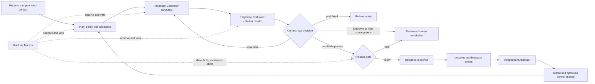

# A Public-Domain LLM Response Assurance Pattern

Status: general future-development research, 2026-08-12. This is not a
`crexx-rag` or RAG-specific design, is not an implemented feature, and does not
authorize work beyond the repository's existing approval gates.

## Public-Domain Dedication

The original material in this document is dedicated to the public domain under
[CC0 1.0 Universal](https://creativecommons.org/publicdomain/zero/1.0/).
To the extent that a jurisdiction does not permit the relevant rights to be
waived, the CC0 fallback licence applies. Anyone may copy, adapt, implement,
rename, publish, or use the pattern for any purpose, including commercial use,
without attribution or permission.

The cited publications and standards remain subject to their own terms. This
document summarizes and links to them; it does not reproduce or relicense them.
Names used here are descriptive standard terminology, not brands or claims of
ownership.

## Purpose

The goal is to make an LLM response safer and more dependable without making
the process mysterious to users, reviewers, or business owners. The same small
set of roles and decisions should appear in every deployment. Configuration
changes the depth of checking, independence, cost, latency, and human
involvement; it does not create a different process for every use case.

The proposed core is:

> **Generate -> evaluate -> revise -> release, abstain, refuse, or escalate.**

It is a maker-checker, or producer-reviewer, pattern with a bounded
generate-critique-revise loop. A runtime monitor oversees live decisions, and
an Independent Assessor tests offline whether the whole system actually works
over time. At management-system level, the same process fits the familiar
Plan-Do-Check-Act (PDCA) cycle.

This is an assurance pattern, not a claim that model output can be proved safe
or true. It is intended to produce justified, inspectable confidence and a
controlled failure path.

## Why This Is An Established Pattern, Not A Proprietary Method

The proposal combines existing ideas rather than presenting a new algorithm:

- **Plan-Do-Check-Act (PDCA)** is a long-established continuous-improvement
  cycle and is also the management-system structure described for ISO/IEC
  42001.
- **Maker-checker and separation of duties** divide production from approval.
  NIST SP 800-53 uses the standard term `separation of duties` to reduce the
  risk of abuse without collusion.
- **Generate-critique-revise** is used in published work including
  Constitutional AI and Self-Refine.
- **Independent verification questions** are used by Chain-of-Verification to
  reduce factual hallucination in the tasks it studied.
- **Test, evaluation, validation and verification (TEVV)**, independent
  assessment, real-time monitoring, post-deployment monitoring, incident
  review, and defined human oversight are all present in NIST AI RMF guidance.
- **Assurance across the lifecycle** through impact assessment, audit,
  performance testing, ongoing testing, and evaluation is standard assurance
  terminology.

Using this pattern does not by itself establish conformity with ISO/IEC 42001,
NIST guidance, sector regulation, or any other standard.

## Stable Roles And Standard Terms

Business-facing labels can remain constant while an implementation maps a role
to deterministic code, one or more models, a specialist, or a human reviewer.

The primary labels below are deliberately functional. `Developer` commonly
means the person or team building the system, `marker` is education-specific,
and `auditor` may imply a formally independent or regulated audit engagement.
Generator, evaluator, runtime monitor, and independent assessor are clearer
across engineering, assurance, and business settings. The familiar alternative
terms remain useful when explaining how the pattern relates to existing work.

| Stable label | Standard technical terms | Responsibility | Must not do |
| --- | --- | --- | --- |
| **Response Generator** | generator, producer, maker | Produce a candidate response, identify material claims, cite available evidence, and state uncertainty | Approve its own final response |
| **Response Evaluator** | evaluator, critic, checker, judge | Assess the candidate against a versioned rubric and return criterion results, blockers, and repair instructions | Silently rewrite the response or hide an unknown behind an average score |
| **Runtime Monitor** | runtime monitor, online monitor, policy monitor | Independently watch the live control flow, enforce hard controls, detect anomalies, and hold or escalate a release | Become the response author or weaken policy to meet a latency target |
| **Independent Assessor** | independent evaluator, TEVV assessor, post-deployment assessor | Evaluate samples, incidents, outcomes, drift, bias, calibration, and control effectiveness without a live-response deadline | Change live prompts, policies, thresholds, or models without change control |
| **Orchestrator** | orchestrator, policy enforcement point, release gate | Apply the state machine, risk profile, retry bound, permissions, and final release decision | Use model prose as an unvalidated control instruction |
| **Risk Owner** | accountable owner, human decision owner | Set risk tolerance, approve policy and exceptions, and own high-consequence escalations | Treat the presence of a human as automatic proof of safety |

The Response Generator and Response Evaluator are functional roles. They may use
the same underlying model in low-risk settings, but different prompts do not
create strong independence. Higher-risk settings should increase independence:

1. **logical independence** — separate context, instructions, and state;
2. **technical independence** — a different model, deterministic verifier,
   external evidence source, or tool; and
3. **organizational independence** — a reviewer or assurance function outside
   the delivery team.

The Independent Assessor should be organizationally independent where
consequences warrant it. Full independence is not always affordable, but its
absence must be recorded as residual risk rather than hidden by giving one
model several role names.

## The Core Algorithm

### 1. Plan: classify the request and construct the control record

The Orchestrator records the intended use, users, allowed data and tools,
applicable policy version, risk tier, required evidence, evaluation rubric,
release threshold, hard blockers, latency/cost budget, and escalation path.

Retrieved or otherwise untrusted third-party content is classified as data, not
instruction. Permissions for tools or consequential actions are established
independently of anything found in a document, web page, tool result, model
response, or evaluator finding.

### 2. Do: generate a candidate response

The Response Generator receives the user request, permitted context, and the
response contract. It returns:

- the candidate response;
- a list of material factual or decision-relevant claims;
- the evidence reference for each claim when evidence is available;
- explicit uncertainties or missing information;
- any proposed tool call or external action as a separate structured plan; and
- a concise rationale summary suitable for assurance review, not hidden
  chain-of-thought.

Claims with no available support are labelled as unverified, presented as
hypotheses, or omitted according to the risk profile. Creative or subjective
work may legitimately have no factual evidence requirement, but it still has
task, policy, privacy, and security constraints.

### 3. Check: evaluate the candidate against an explicit rubric

The Response Evaluator assesses the candidate; it does not simply answer the
question again. Each applicable criterion receives:

- `PASS`, `FAIL`, `UNKNOWN`, or `NOT_APPLICABLE`;
- `BLOCKER`, `MAJOR`, or `MINOR` severity;
- a short diagnostic tied to response text or evidence;
- the evidence or test used for the judgement; and
- a bounded repair instruction when repair is possible.

The minimum general rubric is:

1. **task fulfilment** — relevance, completeness, and adherence to requested
   format;
2. **correctness and grounding** — support for material claims, citation
   entailment, computation, and consistency;
3. **uncertainty and calibration** — unknowns, assumptions, and limitations are
   represented honestly;
4. **safety and policy** — prohibited or harmful assistance, required
   safeguards, and domain-specific constraints;
5. **security and privacy** — prompt injection, secrets, personal data,
   permissions, and least privilege;
6. **downstream safety** — output encoding and validation for its destination,
   especially code, HTML, SQL, shell, URLs, file paths, and tool arguments; and
7. **communication quality** — clarity, proportionality, accessibility, and
   avoidance of misleading authority.

A hard blocker cannot be cancelled by a high average score. A single scalar
may be retained for trend reporting, but the release decision uses criterion
results and explicit policy.

### 4. Act: revise, release, abstain, refuse, or escalate

If the evaluation contains repairable failures, the Orchestrator sends only the
structured findings and permitted evidence back to the Response Generator. A
new candidate is issued with a new identifier and is evaluated again.

The loop is bounded by attempts, time, and cost. Its terminal decisions are:

- `RELEASE` — all required checks pass and no runtime hold exists;
- `REVISE` — a bounded repair is justified;
- `ABSTAIN` — the system cannot establish sufficient evidence or confidence;
- `REFUSE` — policy prohibits the requested assistance; or
- `ESCALATE` — a human or domain specialist must decide.

At the retry limit, the system abstains or escalates. It does not lower the
threshold, repeatedly paraphrase the same unsupported content, or select the
highest-scoring failed draft.

### 5. Monitor the live path before release

The Runtime Monitor receives immutable events from the Orchestrator rather than
private messages from the Response Generator. It may check the request,
evidence use, evaluator result, revision history, tool/action plan, and final
candidate. It has independent authority to `ALLOW`, `HOLD`, `ESCALATE`, or
`ABORT`.

Runtime controls should combine deterministic mechanisms and semantic review.
Examples include permission checks, secret and personal-data detection,
source/citation resolution, numeric or code tests, injection indicators,
policy classifiers, sink-specific output validation, generator/evaluator
disagreement, unusual score patterns, and a human release gate for
high-consequence uses.

The Runtime Monitor does not need to repeat every evaluator criterion. Its main
value is independent oversight of the process and hard controls, including
detecting a Response Evaluator that is unavailable, inconsistent, compromised,
or simply rubber-stamping drafts.

### 6. Assess outcomes offline and feed governed improvements into the next cycle

The Independent Assessor evaluates privacy-minimized samples and all incidents
or near misses using test sets, domain specialists, user feedback, observed
outcomes, red-team cases, counterfactuals, and slice analysis. It assesses both
the generated responses and the controls that accepted or rejected them.

Findings create proposed changes to rubrics, policies, prompts, test cases,
models, thresholds, or training. A proposed change is validated in an offline
or shadow environment, approved by the Risk Owner, versioned, deployed,
and monitored. The Independent Assessor never creates an unreviewed
self-modifying production loop.

## Reference State Machine



The Runtime Monitor is shown alongside the main path because it monitors the
path; it is not another authoring stage. The Independent Assessor is outside the
response latency path.

## Risk-Tier Configuration

Every tier uses the same state machine and assurance record. The tier changes
the assurance strength.

| Tier | Typical consequence | Response Evaluator | Runtime monitoring | Release |
| --- | --- | --- | --- | --- |
| **Low** | Easily reversible, informational or creative | Deterministic checks plus sampled or lightweight semantic evaluation | Hard controls on every response; semantic sampling | Automatic when required checks pass |
| **Standard** | Material business use but reviewable and reversible | Semantic evaluation on every response, supported by tools where applicable | Hard controls plus targeted semantic checks | Automatic, with bounded revise/abstain |
| **High** | Safety, rights, health, legal, financial, security, or irreversible consequence | Independently configured evaluator, verified evidence, domain rubric, and disagreement handling | Full-path monitoring with fail-closed blockers | Qualified human or specialist approval; no autonomous consequential action |
| **Prohibited** | Outside policy or lawful authority | Record the reason; do not optimize an answer | Confirm refusal and prevent tool use | Safe refusal or authorized incident route |

The table is a default, not a universal risk classification. Each deployment
must define consequences and risk tolerance for its context. High-risk use may
require regulation-specific controls that this general pattern does not supply.

## A Minimal Structured Contract

A vendor-neutral implementation needs stable records more than elaborate agent
personas. A minimal control event contains:

```text
request_id, response_id, parent_response_id
timestamp, use_case, risk_tier
policy_version, rubric_version, configuration_version
generator_system_and_version, evaluator_system_and_version
permitted_context_refs, evidence_refs, proposed_action_refs
criterion_results[], blocker_codes[], uncertainty_codes[]
runtime_audit_decision, release_decision, escalation_ref
latency_and_cost, outcome_or_feedback_refs
```

Retain hashes or references rather than sensitive raw content where possible.
Apply a documented retention schedule, access control, redaction, and deletion
process. Do not log credentials, unnecessary personal data, hidden
chain-of-thought, or unrestricted copies of confidential prompts and responses.
Store concise decision rationales, evidence, test results, and policy codes.

## Failure And Degraded Modes

Safe operation requires explicit behavior when a control is unavailable:

- if the Response Evaluator fails, do not treat absence as a pass;
- if the Runtime Monitor or monitoring channel fails, high-risk responses are
  held;
- if Generator and Evaluator disagree repeatedly, use a second independent check,
  abstain, or escalate;
- if evidence cannot be resolved, label the claim unverified or remove it;
- if a required tool result is stale, malformed, or outside its permission
  scope, reject it;
- if the retry budget is exhausted, abstain or escalate;
- if the assurance record store is unavailable, follow the tier's declared
  fail-open or fail-closed rule and emit an operational alert; and
- if monitoring detects an incident pattern, the Orchestrator can disable a
  feature, model, tool, or risk tier through a versioned kill switch.

For high-risk use, required assurance controls should fail closed. In lower
risk settings, a deliberately reduced response—such as an answer without tool
use or unverified claims—may be safer and more useful than either an unchecked
answer or a total outage.

## Evaluation Before Deployment

The framework itself must be evaluated; adding more model calls is not evidence
of improved safety.

1. Define the intended use, foreseeable misuse, affected groups, material harm,
   and prohibited outcomes.
2. Build a versioned, representative test set with ordinary cases, edge cases,
   adversarial cases, known incidents, counterfactuals, and domain-specialist
   labels. Keep a held-out set.
3. Compare the proposed pipeline with a single-pass baseline under the same
   conditions.
4. Run the Response Evaluator and Runtime Monitor in **shadow mode** before
   allowing them to gate responses. Measure disagreement and false decisions
   without affecting users.
5. Calibrate release thresholds against human or externally verified labels,
   not against the Generator's preferences.
6. Test control failures, timeout, model unavailability, monitoring or record
   loss, prompt injection, malicious evidence, permission escalation, and
   retry exhaustion.
7. Start with reversible low-risk use, retain rollback, then expand only when
   evidence supports it.

At minimum, report:

- task success and material-claim support rate;
- unsafe or materially incorrect release rate;
- over-blocking and unnecessary refusal rate;
- Response Evaluator and Runtime Monitor precision, recall, calibration, and
  disagreement;
- human overturn and escalation outcomes;
- incident and near-miss rate;
- performance by relevant user, language, content, and risk slices;
- revisions per response and convergence/failure rate;
- p50/p95 response latency and incremental cost; and
- drift across model, policy, rubric, data, and tool versions.

There is no responsible universal pass percentage. Risk owners must set
thresholds from consequence, legal obligations, measurement uncertainty, and
the quality of available ground truth. Report confidence intervals or sample
sizes where quantitative claims could otherwise look more certain than they
are.

## Known Limitations And Anti-Patterns

- **Common-mode failure:** several roles using the same model, training data,
  prompt assumptions, or compromised evidence may confidently agree and still
  be wrong.
- **Judge bias:** LLM evaluators can show position, verbosity,
  self-enhancement, and reasoning biases. They require calibration, order
  controls where relevant, deterministic tests, and human/external anchors.
- **Weak intrinsic self-correction:** asking a model to reconsider without new
  evidence or feedback can preserve or worsen an error. Revision must be driven
  by an explicit diagnostic, test, or evidence check.
- **Automation bias:** a human approver may rubber-stamp a polished output.
  Review interfaces should foreground blockers, evidence, uncertainty, and the
  decision required.
- **Goodhart effects:** optimizing one aggregate evaluator score encourages
  superficial compliance. Preserve per-criterion hard gates and periodically
  refresh held-out tests.
- **Infinite refinement:** repeated critique can add latency, cost, and new
  errors. Bound the loop and preserve abstention.
- **Assurance theatre:** logging every token without testing whether controls catch
  harm creates volume, not assurance.
- **Unsafe output use:** even a good natural-language answer is untrusted input
  to HTML, code execution, databases, file systems, or tools. Validate and
  encode for the downstream sink, and authorize actions separately.
- **Silent online learning:** automatically changing prompts or policy from
  live feedback can amplify attacks and drift. Use offline evaluation and
  governed change control.

The pattern does not guarantee factual correctness, eliminate hallucination,
replace professional judgement, provide legal compliance, or make a deployment
safe merely by assigning all the named roles.

## Suggested Future Development Sequence

This sequence is intentionally implementation-neutral and may be used inside
or outside this project:

1. **Specify:** write the use-case risk taxonomy, response contract, rubric,
   hard blockers, escalation routes, structured records, retention policy, and
   threat model.
2. **Build an offline harness:** replay a single-pass baseline and the proposed
   loop against held-out and adversarial cases.
3. **Run shadow mode:** operate the Response Generator, Response Evaluator, and
   Runtime Monitor without changing releases; calibrate them against independent
   labels.
4. **Gate low-risk use:** enable bounded revision, abstention, monitoring holds,
   rollback, and operational alerts.
5. **Add higher-risk controls:** stronger technical and organizational
   independence, verified evidence, domain specialists, and human release.
6. **Institutionalize offline assurance:** scheduled sampling, slice testing,
   incident review, red-teaming, drift detection, transparent reporting, and
   approved versioned improvements.

No stage should advance because the components merely run. Advancement needs
evidence that the complete system reduces unacceptable releases without
creating disproportionate refusals, delay, cost, privacy exposure, or new
failure modes.

## Use Beyond This Repository

Nothing in the pattern requires retrieval-augmented generation, a knowledge
graph, cREXX, a particular model, or a particular vendor. It can wrap a chat
assistant, document generator, code assistant, recommendation system, customer
service workflow, decision-support tool, or tool-using agent.

An implementation may use different user-facing words, but retaining the
stable functional boundaries—Response Generator, Response Evaluator, Runtime
Monitor, Independent Assessor, Orchestrator, and Risk Owner—makes the process
easier to explain, compare, assess, and improve across settings.

## Evidence Base And Design Implications

| Source | Evidence used here | Important limit |
| --- | --- | --- |
| [NIST AI RMF 1.0](https://doi.org/10.6028/NIST.AI.100-1) | Use-case-aware risk management across Govern, Map, Measure, and Manage; defined roles and lifecycle monitoring | Voluntary, general framework; it does not prescribe this response algorithm |
| [NIST Generative AI Profile, NIST AI 600-1](https://doi.org/10.6028/NIST.AI.600-1) | Independent assessment, fact-checking, source/citation review, real-time and post-deployment monitoring, human oversight, TEVV, incident and near-miss processes | Suggested actions must be tailored to context and risk; testing has real-world validity limits |
| [NIST SP 800-53 Rev. 5, AC-5](https://csrc.nist.gov/pubs/sp/800/53/r5/upd1/final) | Separation of duties as an established control concept | A security-control catalogue, not an LLM response-quality standard |
| [ISO overview of ISO/IEC 42001](https://www.iso.org/artificial-intelligence/ai-management-systems) | PDCA as a familiar AI management-system cycle | This pattern is not an ISO/IEC 42001 implementation or conformity claim |
| [UK government Introduction to AI assurance](https://www.gov.uk/government/publications/introduction-to-ai-assurance/introduction-to-ai-assurance) and [portfolio of assurance techniques](https://www.gov.uk/guidance/portfolio-of-ai-assurance-techniques) | Standard assurance terms including impact assessment/evaluation, audit, verification, performance testing, and ongoing testing | Technique selection and assessor independence remain context-specific |
| [Constitutional AI](https://arxiv.org/abs/2212.08073) | Safety-oriented use of critique and revision, plus AI feedback | A training approach with its own assumptions; not proof that a runtime critic makes every response safe |
| [Self-Refine](https://arxiv.org/abs/2303.17651) | Iterative feedback and refinement improved results across the tasks studied | Same-model self-feedback can share errors; reported gains do not generalize automatically |
| [Chain-of-Verification](https://arxiv.org/abs/2309.11495) | Draft, plan verification questions, answer them independently, then produce a checked response | Results cover selected factual tasks; verification quality still depends on evidence and model capability |
| [Large Language Models Cannot Self-Correct Reasoning Yet](https://arxiv.org/abs/2310.01798) | Intrinsic self-correction without external feedback can fail or degrade reasoning | Focused on reasoning settings studied by the authors; not a claim that all refinement fails |
| [Judging LLM-as-a-Judge with MT-Bench and Chatbot Arena](https://arxiv.org/abs/2306.05685) | LLM judges can be useful at scale but exhibit position, verbosity, self-enhancement, and reasoning limitations | Human agreement in a benchmark does not establish safety or correctness in a deployment |
| [OWASP LLM05:2025 Improper Output Handling](https://genai.owasp.org/llmrisk/llm052025-improper-output-handling/) | Treat model output as untrusted before passing it to downstream interpreters, databases, file systems, or tools | Security guidance addresses one part of the full assurance problem |

## Research Questions To Keep Open

- Which criteria are best enforced deterministically, by a model, by a domain
  tool, or by a human in each use case?
- What degree of model, data, and organizational diversity produces useful
  independence rather than duplicated cost?
- How should evaluator calibration and assurance sampling change as base
  models and user populations drift?
- When does the loop improve safety and task success enough to justify its
  latency, cost, energy use, and privacy footprint?
- Which concise assurance artifacts give stakeholders justified confidence without
  collecting unnecessary sensitive content?
- How can affected users challenge, correct, or appeal a response and have that
  feedback represented in offline evaluation?

These questions should be answered with deployment-specific evidence, not by
renaming roles or adding more agents.
