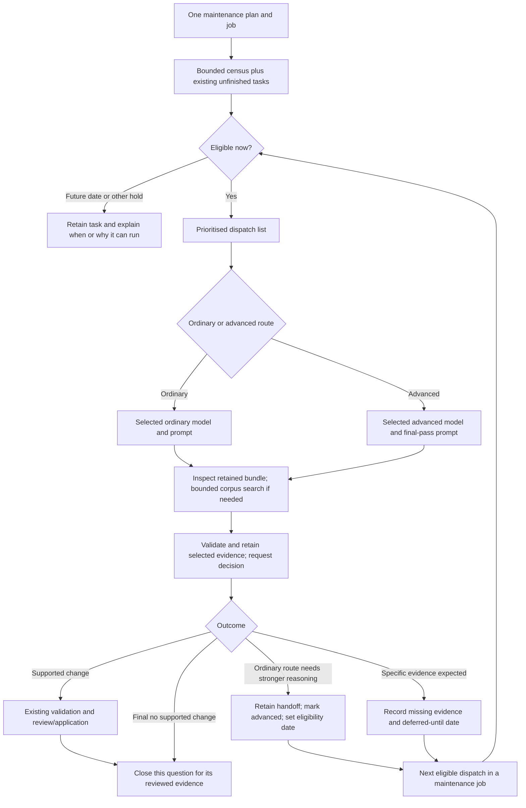

# One maintenance job: prioritisation, evidence and escalation

**Status: implemented and locally qualified; AC1–AC12 complete for the approved
local scope.** The [test-process implementation](test-process-redesign-20260916.md)
records 121 enabled functional passes, a separate scale pass and the explicit
upstream #701 exclusion. The capability table below preserves the pre-change
approval assessment; the delivery evidence map gives the implemented status.
The user approved the bounded scope and recommended defaults in this task.
Local implementation, focused regression work and final combined QA may proceed.
Hosted calls, corpus processing, installation, commit and push remain separate.
Baseline: `main` at `5aad670`, with the existing untested MCP-stop batch retained.
The [task guide](work-tasks-and-escalation.md) describes the current data model;
this document retains the approved incremental work and acceptance criteria.

## Plan vision / outcomes

For the user, this remains **one maintenance job**. Maintenance discovers work,
considers existing unfinished tasks, excludes work that is not yet eligible,
orders the remainder, selects its prompt and model, and processes it within the
job's existing limits. Ordinary and advanced reasoning are routes through the
same task system. The purpose is useful semantic search and analysis, not a
perfect graph or endless reconsideration.

A worker unable to decide can collect and preserve the relevant evidence,
explain the problem, request advanced reasoning and defer the task. When due,
maintenance selects the advanced model/prompt, retrieves the retained bundle,
refreshes or supplements it if justified, and reaches a supported change or
explicit final no-change. Deferral for expected evidence is exceptional and
specific. Passing a date alone is not new evidence or permission to keep
postponing the same question.

## Requirements

| ID | Required outcome |
| --- | --- |
| R1 | Existing `maintain` planning/run/status journeys cover ordinary and advanced work; no separately operated escalation queue or daemon. |
| R2 | Every unfinished task in the selected scope is considered for eligibility over bounded census/pages. Resolved/superseded history is not redispatched. Explain blocked, reviewed, waived and future-dated work. |
| R3 | Produce an inspectable prioritised list of eligible work, including selected route and reason. A bounded plan need not load the whole backlog or freeze every future dispatch. |
| R4 | Support durable per-task deferral, including six months, independently of transport retry backoff and maintenance-job deadlines. The next maintenance invocation after the date can consider it. |
| R5 | Select both model and prompt by ordinary/advanced route and relevant work family, with shared defaults. Retain effective selection with the evidence and decision. |
| R6 | A resolver can search the existing corpus, inspect source context and page its evidence. Persist the relevant, addressable evidence needed by the next processor. |
| R7 | Escalation, evidence handoff and deferral use the existing task lineage and transaction ownership; do not create a second task ledger. |
| R8 | The advanced final pass concludes with supported change or explicit final no-change. Defer only for specified realistically expected evidence, under the run's evidence-arrival policy. |
| R9 | Completed reasoning stays complete across restart, repeated census, unrelated ingestion and routine configuration changes. Explicit reconsideration or relevant new evidence can reopen it. |
| R10 | Retain existing source validation, review modes, budgets, receipts, usage, ownership and recovery controls; expose useful outcomes through ordinary maintenance status. |

## Proposed processing flow

The diagram shows semantic outcomes, not every failure path. Invalid output,
provider failure and allowance exhaustion remain visible bounded execution
outcomes. They do not justify invented facts or fabricated final no-change.

## Capability assessment at approval

This table preserves the pre-implementation review. Supported meant existing
related coverage; partial meant reusable components with a missing journey.
Current implementation and qualification are recorded in the
[delivery record](maintenance-escalation-delivery-20260916.md); the numbered
acceptance criteria below remain the completion contract.

| Capability | Current status and evidence | Needed increment |
| --- | --- | --- |
| C1. One bounded maintenance job | Supported for ordinary work: windows, jobs, configured process workers, continuation, budgets and source scope. | Extend the same journey to advanced work. |
| C2. Discover and revisit work | Partial: category cursors, deduplicated evidence tasks and current-chunk/missing-vector census exist. Dispatcher selects only pending standard tasks. | Consider eligible advanced and deferred tasks without reopening terminal decisions or bypassing actual reviews. |
| C3. Prioritise and explain selection | Partial: kind priorities plus age, deterministic ordering and bounded dispatch exist. | One shared route-aware ordering and an inspectable projection; advance due escalations according to the approved order. |
| C4. Per-task deferral | Partial: `not_before_epoch` exists, currently used for retry delay. Global `maintenance.retry_seconds` accepts at most seven days. There is no six-month per-task defer action. | Reuse the timestamp with explicit semantic deferral, retained reason/date and due-task selection. Retry reconciliation and successor creation must preserve it. |
| C5. Prompt and model selection | Partial: role/provider configuration, prompt inspection and hashes exist. Resolution uses its own objective but the extractor model; task-specific questions are mostly compiled. | Ordinary/advanced bindings with model, prompt and existing execution limits; small work-family overrides, explicit fallback and effective inspection. |
| C6. Corpus search and source inspection | Supported for external MCP agents: lexical `query inspect`, task evidence/inventory, citation paging and profile inspection. | Expose those existing read services inside a bounded internal resolver cycle. |
| C7. Search-capable internal resolver | Not supported: current worker makes structured generation requests. Codex's provider explicitly instructs no tools, files or commands. | A small cREXX-owned request/read/result loop; changing the prompt alone is insufficient. |
| C8. Durable evidence bundle | Partial: frozen evidence, fingerprints, paged inventory and complete refresh with successor lineage exist. Refresh reconstructs the current subject's evidence scope. | Bind additional relevant search-selected source spans into the retained bundle; preserve mandatory affected supports and exact citations. |
| C9. Worker-owned refresh/escalation | Partial: external refresh and escalation exist, but external refresh refuses active worker ownership or pending review. | Internal fenced transition in the task owner to checkpoint evidence, escalate/defer and release work coherently; retain the external refusal rules. |
| C10. Final and deferred outcomes | Partial: `retain` can settle cases; `unresolved` leaves questions open. No final-pass model/prompt/deferral contract exists. | Explicit terminal no-change and justified wait-for-evidence semantics through existing state/decision owners. |
| C11. Multiple reasoning calls and recovery | Partial: durable receipts, saved-output reuse, allowances and task counters exist. They do not qualify a multi-step search/resolution cycle or separate final-pass allowance. | Account for every reasoning turn; distinguish standard exhaustion from advanced eligibility without erasing total usage; recover completed work without blind repeated calls. |
| C12. Apply decisions consistently | Partial: shared worker and external validators/reviews exist. ESC-VAL-01 and ESC-VAL-02 remain open; ESC-OPS-01 invalidates sibling external plans after publication. | Repair the bounded validation findings; serially validate/apply against current state while reusing unaffected expensive reasoning where proved safe. |
| C13. Report useful completion | Partial: task states, retries, usage and source backlog can be inspected. Review state combines several reasons. | Report due ordinary/advanced, deferred-until, actual review holds, changed, final no-change and technical failures through existing status/list owners. |
| C14. Preserve completion during rediscovery | Partial: unchanged evidence/policy tasks deduplicate; prompt/context changes can generate new identities. Unchanged ingestion is a no-op. | Preserve final decisions and examined-with-no-claims outcomes through census; avoid re-opening merely because an unrelated generation or route default changed. |

## Smallest proposed additions

### 1. One eligibility and ordering policy

Reuse the durable task table, scope rules and indexed census. Inspect all
unfinished work over bounded pages; do not make every task runnable. Real
pending reviews, active ownership, waivers and technical holds still matter.
An advanced task is not eligible merely because `state='review'`.

Recommended ordering is: necessary prerequisite repairs, due advanced work,
then other due work; use existing priority/age and stable identity tie-breaks
within each group. Prerequisite means work needed for the selected operation,
not a requirement to finish all corpus repairs before considering an escalation.
Expose the selected order and excluded counts through the current maintenance
plan/status vocabulary. Strict advanced-first can delay ordinary enrichment
under a continuous escalation stream; show that tradeoff and leave ordering
as operator policy, not an extra fairness service.

Recheck eligibility at dispatch. A displayed plan is a bounded view and does
not authorize a stale task, substitute a new model silently or extend budgets.

### 2. Deferral without another scheduler

Reuse `not_before_epoch` as the earliest permitted reconsideration time, with
reason, missing-evidence condition and original evidence identity in retained
decision data. Add per-task defer/inspect/change behavior to existing maintenance
controls and validated resolver outcomes. Final names are not invented here.

- Accept an explicit date/time; a human duration such as six months must be
  normalized once to an inspectable absolute timestamp, with calendar/timezone
  semantics documented. It is not the global provider retry interval.
- The default is a hard earliest date: new ingestion before it does not silently
  override the operator's defer choice. An explicit reconsideration can.
- On or after the date, the next ordinary maintenance run performs a cheap
  relevant-evidence check. If evidence changed, refresh and process. If it did
  not, the final-pass policy closes with no-change or exposes an operator action;
  do not automatically roll the date forward forever.
- The date never supplies a semantic answer. If no retained final assessment
  justifies closure, the selected advanced model must provide the final decision;
  an elapsed timer cannot fabricate a no-change rationale.
- Allow immediate eligibility for escalation when no waiting is useful. A
  deferred task does not occupy a worker or keep a job alive for six months.
- Retry backoff, restart, census, evidence successors and control commands must
  not silently shorten an explicit deferral. Explicit reset remains an intentional
  override with its current clear recovery semantics.

No background wakeup is introduced. Running maintenance periodically remains
an operator choice; a due date is not itself a running job or an automation.

### 3. Select prompt and model together

Add one advanced reasoning binding beside an ordinary default, using the
existing selected policy, provider catalogue, privacy/charging and inspection
owners. Bind both model and effective prompt; allow a small work-family prompt
override when the action contract requires different instructions. Do not
require separate models/prompts for all thirteen kinds.

Extraction, identity/lifecycle decisions and embedding operations retain their
correct schemas and validators. In particular, an escalated `concept-review`
must not automatically repeat ordinary extraction solely because of its kind;
advanced routing must consume the handoff and choose the approved resolution
operation. New relationship proposals still pass their existing claim validator.

Record provider/model, effective prompt and schema identities, evidence bundle
identity, route and evidence-arrival policy on the execution/decision. A missing
advanced binding yields an actionable skipped/blocked route without consuming
a call; do not silently fall back to a weaker model. Exact provider/model values
are selected operator configuration, not hard-coded in this design.

The advanced route needs a bounded allowance after ordinary exhaustion. Reuse
job admission and receipt accounting; give the route its explicit call limit
while preserving cumulative task history and all shared job caps. Switching
routes is not permission to reset spend, uncertain outcomes or repeat cycles.

### 4. Bounded search and durable evidence handoff

Recommended implementation shape: the model returns a structured request to
search or inspect evidence; cREXX validates it, invokes an existing read service,
returns the bounded result and asks for the next structured response. This
works with the current structured-generation provider pattern and avoids
requiring arbitrary native agent tools or a second provider-specific runner.
The execution coordinator is still new work and must be honestly scoped as such.

Start with lexical corpus search, exact citation/context reads, stored/current
task inventory and profile vocabulary. `query inspect` is the existing zero-write,
zero-provider search route. Ordinary query/path/timeline/answer operations can
write gaps or call providers; they are not interchangeable read helpers. Wider
graph navigation can be added only if these existing bounded services cannot
answer the agreed use case. No web browsing or corpus ingestion is part of this
resolver increment.

Persist exact source IDs/spans and their relevance, not merely the model's prose
summary. Existing refresh means complete **within the task's defined scope**,
not all possible evidence anywhere in the corpus. Extend its owner to add the
selected evidence; never silently discard required conflict/claim supports to
fit a model context. Page the retained bundle, and report incomplete coverage
or explicit evidence limits. Additional search results are leads until bound
and validated. Mere appearance in search does not justify a claim.

Use configured bounds for reasoning calls, read operations, bytes/tokens and
elapsed time. Repeated identical requests must not create an unbounded loop.
Persist handoff evidence/reason before releasing the task. Existing receipt
recovery preserves completed calls; loss of unfinished exploration remains
acceptable. Do not build conversation archival or exactly-once recovery beyond
the existing completed-output and accounting obligations.

Worker-held refresh is a new internal task transition: it must validate its
own current fence, checkpoint/release coherently and preserve evidence lineage.
Do not call the external refresh API while owning an item or remove its guard
globally to make that work. Existing external agents keep their supported route.

### 5. Bounded semantic completion

Use existing task state plus retained decision details rather than inventing
an escalation state machine. Pending ordinary/advanced and future eligibility
can share the same scheduler; `resolved` records both final change and final
no-change, distinguished in outcome reporting. `review` remains for a real
approval requirement; `unresolved` alone does not encode a scheduled deferral.
The precise compatibility mapping for existing mixed review states belongs in
the implementation acceptance, not a wholesale historical rewrite.

The ordinary pass may conclude, request stronger reasoning, or defer with a
specific reason. The final pass may change or conclude no-change. It may defer
only when missing evidence is realistically expected and the selected policy
permits it. With no more relevant ingestion expected, uncertainty becomes a
reasoned final no-change, not a forced assertion. Neither route may create an
unlimited follow-up/escalation cycle on the same evidence.

“Final” means final for the reviewed evidence and question, not infallible or
permanent across future discoveries. It does not disable supervised review,
source validation or effect checks. Automatic mode may apply permitted validated
decisions; supervised mode retains actual approval holds. No new universal
approval layer is proposed.

Keep publication serial. Revalidate a retained response against current relevant
state before applying; unrelated generation changes should not force another
model call when reuse is demonstrably safe. Changed supports/identity/profile
must still reject or refresh. This is the bounded ESC-OPS-01 work, not removal
of its current generation check without a replacement proof.

## Ownership and existing coverage to extend

| Owner | Changes or reuse | Existing acceptance families to inspect first |
| --- | --- | --- |
| `ragbacklog` | Eligibility/order, deferral, evidence bundle, fenced handoff, terminal decisions and reviews | `durable_backlog`, `durable_backlog_provider`, `task_reset`, source backlog/maintenance regressions |
| `ragconfig`, `ragconfigfile`, `ragcanonical`, policy/prompt inspection owners | Route model/prompt, limits and evidence-arrival policy; canonical identity | `regression_policy_file`, `regression_policy_file_vm`, `regression_prompt_inspection`, `regression_prompt_contract` |
| `ragresolutioncontract`, extraction/quotation contracts | Bounded search requests and final/deferred outcome schema; applicable work instructions | Prompt-contract, claim-policy, grounding and provider-validation cases |
| `ragapplicationprovider`, provider contracts/adapters | Bounded request/result coordinator; reuse existing generation transports | `codex_protocol`, `codex_application`, Gemini provider/maintenance cases |
| Query/citation services and evidence owner | Read-only exploration and validated selected-span retention | Query, native surfaces, result contracts, existing refresh/inventory cases |
| `ragwork`, `raglifecycle`, admission/usage owners | Route allowance, worker fencing, receipt recovery and deferral preservation | Native receipts/interruption/admission, lifecycle holds, retry/reset cases |
| `ragcommandcatalog`, query/report owners | Shared plan/list/status and per-task controls | Command catalogue/arguments/metadata and documentation contract |

Source anchors: `ragbacklog` census/dispatch, `taskretryfacts`, `_refreshpacket`,
`planbacklogrefresh` and `applybacklogrefresh`; `ragresolutioncontract.resolutionactions`;
`ragapplicationprovider` resolution branch; `codex_provider` thread/turn request
construction. `backlog_scenario` already characterizes external escalation,
semantic versus transport failure, evidence refresh, ownership refusal and
saved-evidence resolution. Those tests are reusable controls, not evidence that
the proposed internal search/deferral journey already works.

## Numbered acceptance criteria

- [x] AC1. One maintenance job processes a mixed ordinary/advanced fixture using
  the selected routes, and exposes the same selection through CLI/MCP planning
  and status. No separate escalation invocation is required.
- [x] AC2. A paged backlog cannot hide later eligible tasks; necessary prerequisites,
  due advanced tasks and ordinary tasks follow the approved deterministic order.
  Actual review, waiver, ownership and scope controls remain effective.
- [x] AC3. A six-month deferral survives restart, retry reconciliation and evidence
  successor creation; nothing runs early. At its due date, a maintenance run
  reconsiders it without extending the job deadline or starting a daemon.
- [x] AC4. Both model and prompt are selected and recorded; work schemas remain
  appropriate. Missing/invalid route configuration refuses before provider use;
  ordinary-route exhaustion does not consume the advanced route's distinct
  allowance, while total calls/usage and shared budgets remain cumulative.
- [x] AC5. A model can request bounded lexical searches and source/context reads,
  including evidence outside the original packet, then cite that evidence only
  after validated binding. Forged IDs, incomplete required-support bundles,
  repeated requests and read/call/byte limits are handled explicitly.
- [x] AC6. An ordinary worker retains evidence and a reason, escalates and defers;
  the advanced worker subsequently reads that exact handoff, refreshes if needed
  and resolves it. Active-worker and external-review ownership remain fenced.
- [x] AC7. Supported change and final no-change close the task; model/schema/source
  failures are not counted as semantic success. Supervised decisions still await
  review, and automatic decisions obey existing action/impact policy.
- [x] AC8. Expected evidence permits a justified dated deferral; no-more-ingestion
  forces a supported conclusion or final no-change. An expired deferral with
  unchanged evidence cannot automatically defer forever.
- [x] AC9. Repeated census, unchanged ingestion, unrelated publication and routine
  route-default edits do not reopen final work. Relevant selected evidence
  changes or explicit reconsideration can. Preserve examined-with-no-claims
  completion without pretending extraction must always discover a fact.
- [x] AC10. Interruption preserves completed outputs, evidence handoff, receipts
  and usage; ordinary restart does not duplicate completed paid reasoning or
  accepted changes. Existing accepted loss of unfinished work remains allowed.
- [x] AC11. ESC-VAL-01 reproduces and is repaired with valid controls; ESC-VAL-02's
  actual rejecting branch is identified before repair. Revalidated serial
  acceptance reuses unaffected responses and rejects genuinely stale evidence.
- [x] AC12. Focused acceptance, then the complete combined local QA gate passes;
  reviewed metadata/docs agree. Report the approved upstream #701 exclusion
  explicitly and qualify hosted/endurance/platform gates separately.

## Delivery sequence and approval choices

1. **This review:** document requirements, current capabilities and the bounded
   design. Complete; subsequent local acceptance is checked above.
2. **After approval:** confirm baseline coverage and add failing acceptance plus
   controls before implementation; establish the action/state compatibility map
   and effective model/prompt bindings in the existing owners.
3. Implement eligibility/deferral/routing, then bounded search/evidence handoff
   and final outcomes. Repair the named validation blockers in their owners.
4. Complete targeted acceptance as needed, then one full QA gate after the
   combined batch, including MCP-stop and any other agreed changes.

Recommended choices for approval:

- Keep one maintenance job and the existing durable task model; admit due
  advanced work through the same dispatcher.
- Prioritise necessary prerequisites, then due advanced work, then ordinary
  work, with inspectable existing priority/age ordering within each group.
- Use an explicit not-before date, including six months, and no automatic
  rollover or early reopening; reconsider only on a maintenance invocation.
- Add a bounded cREXX-owned search/read cycle over existing corpus services,
  with standard/advanced prompt and model bindings and small family overrides.
- Finish with validated change or final no-change; allow specific expected-
  evidence deferral and preserve existing review modes and accounting.

Approval is requested because Adrian explicitly asked to document this scope
for approval. It is not a new repository or tool-imposed permission gate.
Exact hosted models, call limits and any live-run authority remain selected
configuration/run parameters before a hosted test; this approval document makes
no spend, installation, commit, push or corpus-processing request.
