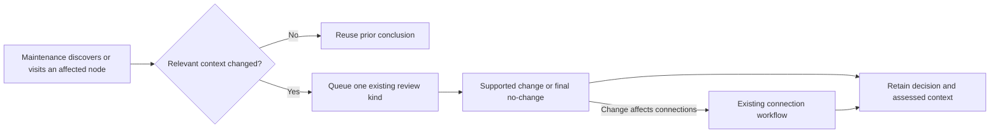

# Reconsideration during maintenance — 20 September 2026

Status: retained pre-change review. The approved implementation and its current
qualification are recorded in [beta delivery](beta-delivery-20260920.md).
The [final beta approval plan](beta-release-plan-20260920.md) now defines the
initial implementation scope and release gates; the behavior review below remains
the baseline. Its background-sampling option is outside that beta scope.
The master register tracks this as RAG-MNT-006. The operator's acceptance standard
is useful, evidence-supported results that improve with subsequent maintenance,
not perfect decisions on every pass. A final decision is final for its current
evidence and question, not immutable historical truth.

## What the baseline implementation did

The owner is `crexx/application/ragbacklog.crexx`:

| Capability | Current behavior and limit |
|---|---|
| Discover work | `_scan` selects open alias issues, pending claim conflicts, active notes, recurring query gaps, sparse active concepts, source chunks, missing embeddings and identity reviews triggered by open alias ambiguity. It also expands active migration workflows. This is selective discovery, not a review of every node. |
| Avoid repeating unchanged conclusions | `enqueuebacklogtask` rebuilds a bounded evidence packet and reuses a resolved task with the same kind, subject, workflow and evidence fingerprint. Ordinary model/prompt changes do not themselves reopen that conclusion. |
| Reconsider changed evidence | A subject rediscovered by the census can receive a new task when its packet changes. Waiting old interpretations are superseded; resolved history is retained. `_refreshduetask` also refreshes due work before dispatch and creates a linked successor when necessary. Not every discovery-created successor currently has an explicit parent link to an older resolved task. |
| What changes are visible | Packets contain subject state/version/aliases, relevant source spans and source-scoped catalogue entries; concept packets include recent versions and competing identities. Fingerprints detect represented packet changes. They are not a guarantee that every relevant change anywhere in the surrounding graph is represented or selected. |
| Apply and reconnect | Accepted reuse/distinct decisions enqueue chunk follow-up extraction. Split/merge workflows create affected-connection tasks and guard retirement until their work is accounted for. Resolving the initiating task does not finish the workflow. |
| Reuse a previous occurrence decision | `resolveknownmention` requires the selected identity to remain active and retain its stored label/type. It does not assess all new competing evidence every time that decision is reused. |
| Prioritize | Due advanced work comes first when enabled, followed by existing priority and age; deferral, review, ownership and call-budget holds still apply. This orders eligible work; it does not supply missing discovery coverage. |
| Explicit reconsideration | `maintain reset TASK_ID` provides deliberate reconsideration, including a completed assessment. It is an operator control, not an automatic substitute for discovery. Read-only query visits do not reopen tasks. |

The important qualification is **rediscovered by the census**. A closed alias
issue or an ordinary well-connected concept may no longer meet a discovery rule.
An unrelated corpus generation change reopens census progress, but does not by
itself invalidate every final decision. Thus the foundations for convergence exist;
“a node was visited, so all relevant past decisions will be reconsidered” is not
a current general guarantee.

## Smallest useful next step

Review discovery and its existing evidence comparison before adding new task
types, statuses, prompts or services. During a maintenance visit, compare the
relevant current evidence and connections with the last assessed context. Reuse
the existing question when nothing material changed. When evidence, an eligible
identity or an affected connection materially changes, enqueue one appropriate
existing review and retain the earlier decision/reason. Accepted structural work
must continue its existing connection workflow. A routine query/read alone
should remain free of these writes and provider calls.

This diagram states the proposed acceptance contract, not a claim that discovery
coverage is already complete. Start with concrete cases involving a closed alias,
a non-sparse concept and a completed no-change decision. Establish which changes
the current packet catches and which selection triggers are missing. Retain
bounded priority/age scheduling; consider a small background review sample only
if change-triggered selection demonstrably misses useful work.

## Checkable acceptance for a later implementation

1. Repeating maintenance on unchanged evidence makes no new reasoning call for
   an already final question; unrelated corpus changes do not invalidate it.
2. Relevant new source support or a changed competing identity makes the affected
   settled question discoverable again, including a closed alias and a concept
   above the sparse-degree threshold. A positive control remains unchanged.
3. Changes to relevant relationships/supports are assessed from their current
   meaning and provenance, not merely a global generation counter. Old decisions,
   source evidence, provider receipts and usage remain inspectable.
4. A split/merge and a resolved alias continue their existing affected-connection
   or extraction follow-up. No fact is copied to every successor to force closure.
5. Repeated visits coalesce the same changed question, respect budgets/deferral
   and end in a supported change or explicit no-change. Read-only search stays
   read-only; no blanket reset or periodic reopening of everything is introduced.

These criteria need characterization and failing/positive regression controls
before implementation, as required by repository guidance. No new corpus run or
model calls were made for this source review.
