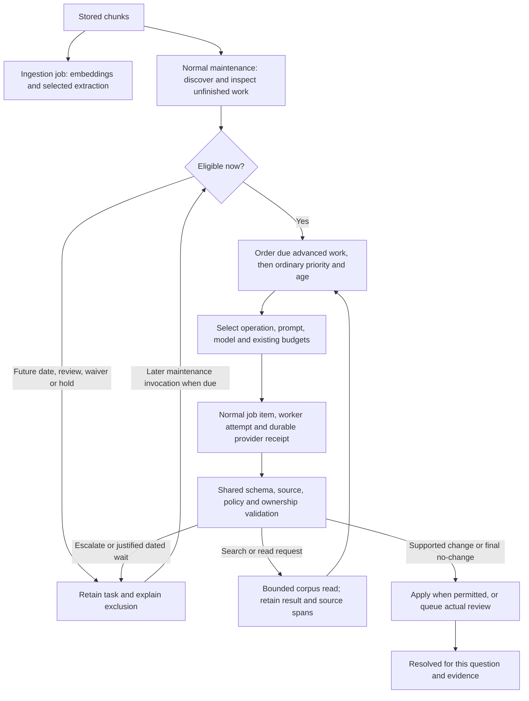

# Work tasks, prompts, models and completion

Implementation guide for the approved 16 September 2026 maintenance change.
Qualification and remaining acceptance are recorded in the
[delivery record](maintenance-escalation-delivery-20260916.md) and
[approved plan](maintenance-escalation-plan-20260916.md). This is not a live
corpus census. The thirteen task families and seven task states remain unchanged.

## Purpose

Maintenance improves semantic search and analysis. It cannot make a corpus
perfect. An assessment may affirm supported material, make a reviewed change,
or conclude that the examined evidence does not justify a change. A specific
evidence or capability wait remains unresolved. Repeating unchanged reasoning
is not progress.

## Current records and routing




A task is the durable question. A job groups executable items under a plan,
configuration snapshot and budget. An item may have multiple worker attempts.
Tasks link to items through `maintenance_task_items`; reviews and provider
receipts remain separate records. Ingestion does not need a maintenance task
for every item. The diagram omits recovery transitions for readability; it
does not imply that every result passes through every node.

### Maintenance task kinds and subjects

Kinds describe the work; subjects identify the object it concerns. Kinds are
text, not a schema-enforced enumeration. Current producers use these families:

| Kind | Subject | Purpose |
| --- | --- | --- |
| `alias-resolution` | `alias-issue` | Reuse a supplied identity, distinguish a meaning, or retain uncertainty. |
| `identity-review` | `concept` | Review classification or mixed meanings. |
| `claim-conflict` | `conflict` | Examine contradictory or differently scoped claims. |
| `analysis-lead` | `note` | Investigate an analysis lead. |
| `query-gap` | `gap` | Investigate a recurring query gap. |
| `sparse-node` | `concept` | Examine a concept with few connections. |
| `concept-review` | `chunk` | Extract/improve a chunk; also used for failed-extraction handoff. |
| `embedding-repair:<profile>` | `chunk` | Restore a missing embedding or link. |
| `alias-follow-up:<issue>` | `chunk` | Follow-up extraction after identity resolution. |
| `connection` | A connection object | Account for one connection during split/merge. |
| `retirement` | `concept` | Close a migration parent after accounting for connections. |
| `follow-up` | Relevant inherited subject | Investigate a focused follow-up question. |
| `provenance-enrichment` | `provenance-chunk` | Explicit optional provenance assessment. |

Handled subject types are `alias-issue`, `concept`, `conflict`, `note`, `gap`,
`chunk`, `provenance-chunk`, `alias`, `mention`, `support`, `claim`, `ambiguity`.
Supported resolution actions depend on subject and workflow; an action such as
`split`, `retain` or `escalate` is not itself a maintenance-task kind.

### States, routing and retry accounting

| Task state | Meaning |
| --- | --- |
| `pending` | Waiting; eligibility still depends on policy, timing, ownership and holds. |
| `dispatched` | Linked work item created; queued versus running belongs to that item. |
| `resolved` | Settled, possibly with no knowledge change. |
| `unresolved` | Question remains unanswered or needs investigation/escalation. |
| `review` | Proposed decision or other intervention required; not always a review row. |
| `superseded` | Replaced by fresh evidence/context or a reset successor. |
| `failed` | Terminal task failure, including exhausted execution allowance. |

Escalation is `required_capability='advanced-reasoning'`, independently of
state and priority. The same maintenance workers select eligible ordinary and
advanced tasks, using their respective configured routes. A worker
escalation becomes `unresolved`; oversized input becomes `review`; explicit
external escalation can retain its existing state. A construction-time evidence
limit can also create `review` without setting advanced reasoning. Therefore
neither all review tasks nor only review tasks form the escalation queue.

Escalation origins currently include `worker`, `validation-failures`,
`evidence-limit`, `external-agent`, `evidence-refresh` and `expected-evidence`. Terminal extraction
content failures use the validation-failure handoff and retain job/item links.
Two task content-validation failures trigger escalation. Transport/admission
failures alone do not. Transport and content failures remain technical failures; exhaustion never
creates a fictional successful semantic decision.

Other task data: `task_id`, `subject_id`, `workflow_id`, `parent_task_id`,
`question`, `evidence_json`, evidence/policy fingerprints, priority,
`not_before_epoch`, timestamps, `last_error`, escalation reason/origin.
Counters have distinct meanings:

- `attempt_count` (public `attempts`): task dispatch count, not model-call count.
- `recorded_calls`: distinct linked provider runs across retained history.
- `retry_calls`: total calls counted after explicit reset baselines.
- `route_calls`: effective calls against the currently selected ordinary/advanced allowance.
- `semantic_failures`: content-validation failures used for escalation.

Ordinary reasoning defaults to `maintenance.maximum_attempts=3`, advanced
reasoning to `maintenance.advanced_attempts=3`, and technical retry delay to
`maintenance.retry_seconds=300`. Advanced calls have a distinct allowance;
recorded total usage and shared job budgets remain cumulative. Selected configuration can differ; embeddings
also have provider-specific retry accounting. Saved output reuse need not make
another model call. External proposals retain actor/model attribution separately
and are not fabricated internal provider receipts or measured usage.

Execution item types are `claim-extraction`, `improve-extraction`, `embedding`,
`maintenance-resolution`. Their ordinary states are `queued`, `running`,
`processed`, `skipped`, `dead_letter`, `cancel_requested`, `cancelled`.
A processed item can leave an unresolved task. Reviews use `pending`,
`accepted`, `rejected`, `dismissed`. Waivers and retry requests are separate
records, not extra task states. Split/merge workflows use `migrating`, `waiting`,
`complete`; resolving their originating task does not finish all connections.

The older `maintenance_items` model still supports compatibility reviewed
maintenance and structural application. Its types are `concept-review`,
`claim-conflict`, `sparse-node`, `stale-embedding`, `query-gap`, `analysis-lead`,
`synonym`, `split`, `merge`, `type-correction`, `retire`, `restore`,
`vector-publication`; states are `pending`, `leased`, `diagnosed`,
`review-required`, `approved`, `applied`, `rejected`, `failed`, `blocked`.
Do not treat these as additional states of the durable task above.

## Prompt and model selection

| Work | Binding | Effective instructions and validation |
| --- | --- | --- |
| Initial extraction and ordinary chunk improvement | `extractor` | Extraction objective, quotation contract, profile vocabulary and extraction schema. |
| Ordinary resolution | Optional `resolver`; otherwise existing extractor model | Resolver objective when configured; otherwise `maintenance.resolution_prompt`. Shared resolution contract and task question always apply. |
| Advanced resolution | `advanced-resolver` | Its own model and objective plus final-pass constraints, retained evidence/history and subject-specific schema. Missing binding is an inspectable block, never a fallback to a weaker model. |
| Explicit advanced chunk extraction | `advanced-resolver` after an `extract` decision | Existing typed extraction schema and source validators; an empty valid result completes the assessment. |
| Embedding | `embedding` | Existing embedding envelope and provider controls. |
| Provenance assessment | Selected maintenance route | Existing specialised provenance contract. |

A binding selects an existing provider entry, which owns the model, reasoning
settings, charging basis, privacy route and provider limits. Optional roles use
the same format-3 `role.NAME.provider`, input/output/cost envelopes, temperature
and `system_prompt` or `system_prompt_file` syntax as existing roles. Older
format-1/2 policies use `role.NAME = PROVIDER_ID` with compatibility defaults;
use format 3 when configuring the role objective and envelopes. No provider
name or hosted model is hard-coded.

`maintenance.identity_prompt` and `maintenance.connection_prompt` are optional
work-family instructions. They supplement the chosen objective and shared
contract; they cannot remove schema, source or final-pass validation.
`ragbacklog._question(kind)` still provides the specific question being asked.

Use `config prompt --role resolution` and `config prompt --role advanced-resolver`
to inspect objectives, effective shared instructions, models and hashes. A frozen
resolution work item records the role, provider/model, prompt and schema hashes,
evidence identity, arrival expectation and retained reasoning history. The
selected task's evidence and question provide its additional context.

The normal durable worker journey uses maintenance mode `automatic` or
`supervised`; `manual` intentionally does not call providers. Legacy `reviewed`
maintenance retains its older reviewed-census compatibility path. Supervised
semantic decisions still require actual review. Automatic application still
obeys the configured permitted actions and impact limits.

## Scheduling, deferral and final outcomes

```sh
crexxrag maintain queue
crexxrag maintain queue --job JOB_ID --limit 20
crexxrag maintain defer TASK_ID --months 6 --reason "Await the scheduled archive release"
crexxrag maintain defer TASK_ID --until 2027-03-16T09:00:00Z --reason "Expected new archive material"
```

Queue inspection is read-only; `cursor`/`next_cursor` page the live eligible
list. With `--job`, it uses that job's frozen policy and includes a snapshot of
at most 98 queued routes. Use the existing paged `job items JOB_ID` /
`rag_job_items` for the full owned item list. Without `--job`, it uses current
selected configuration. Exclusion counts can overlap; do not sum them.
It explains future dates, actual reviews, waivers, failures and missing advanced
bindings. Status additionally reports due ordinary/advanced tasks, deferred tasks, actual reviews, applied-change decisions and final no-change decisions for the window. Maintenance rechecks eligibility at dispatch; a displayed page is not
a reservation. `maintenance.advanced_first` defaults to true. Within each group,
existing priority and age apply. Existing dependency and ownership checks remain
in force; unrelated corpus repairs are not prerequisites for lexical reasoning.

A defer date is a hard earliest date, not a running job. `--months` means UTC
calendar months, clamped to the last day of the destination month; `--until`
requires a timezone-qualified timestamp. The supported range is up to ten years.
No timer or daemon is created. A later normal maintenance invocation considers
due work. Retry reconciliation, census and evidence successors preserve the date.
Explicit `maintain reset TASK_ID` is the deliberate reconsideration path, including for a final assessment. `maintain reset --all` preserves completed tasks.

The `/10` resolution contract includes `dispositions`, `relationship_type` and
`resolution_text` alongside the established fields. Its control and outcome
actions are:

| Action | Meaning |
| --- | --- |
| `search` | `question` requests a bounded lexical corpus search. Results are leads until read and bound. |
| `read` | `object_id` contains an exact corpus citation of at most 8192 bytes. The selected source span is retained in the task packet. |
| `extract` | Advanced chunk reasoning explicitly selects a further call using the existing extraction contract. It cannot request this on the last available call. |
| `defer` | `question` names realistically expected evidence and its relevance; `effective_from` gives the future date. |
| `no-change` | Explicit final no-change with a reason. No fact is asserted and no graph generation is published. |
| `retain` | Affirm the existing supported subject for this assessed context; no graph mutation is needed. A genuine isolate can be retained. |
| `correct-note` | Propose source-supported replacement text for the active note; a review must accept before the old note is superseded. |
| `resolve-gap` | Propose an answer to the original open question with an exact answering source passage; a review must accept before the gap closes. |
| `insufficient-evidence` | Keep the question unresolved and name the new evidence needed to reconsider it. |
| `capability-wait` | Keep a cited, specific correction unresolved and name the missing operation needed to apply it. |

The `/10` strict response includes `resolution_text` for every action. Set it
only for `correct-note`, `resolve-gap` or `capability-wait`; use an empty string
otherwise. A search hit is a lead, not an answered gap. Both correction actions
need an exact source quotation and the current note or gap ID in `object_id`.
They create a pending review, with no corpus change until acceptance. The
accepted decision retains the answer or replacement text and citation; the
replacement is an active observation, while the original note and its links
remain as superseded history. Generic `retain` cannot close a
gap. `no-change` records the limits of the examined evidence; it does not
affirm that an existing statement is correct. A pending review or unfinished
dependent workflow remains an outstanding consequence after the assessment.
Evidence and capability waits stay in the task list but are excluded from
ordinary redispatch. Unchanged discovery and polling make no new provider call.
A material change to the subject, source passages or linked graph context may
create a linked successor; an explicit task reset is the deliberate operator
reconsideration path. Bounded ordinary discovery revisits waits outside their
old selectors; it does not watch for a missing operation becoming available
without a packet change. A reviewed external resolution can also settle a wait.
An unlimited window can close when only these waits
remain, and status still counts them separately.

Unused mutation fields remain empty. Each search/read is a normal paid reasoning
step with its own receipt, followed by a cREXX-owned read. The read itself makes
no provider call, writes no query gap and cannot ingest or browse the web.
`maintenance.search_reads` defaults to four and is bounded to 0..16; route call
allowances and shared job time/token/spend limits also apply. Repeated identical
requests are rejected. The last available reasoning call must conclude or hand
ordinary work to the advanced route, rather than request an unfulfillable read.

Selected spans keep source IDs and byte offsets. Existing affected claim supports
remain mandatory; supplementary search spans do not replace them. Incomplete or
oversized packets produce an explicit limit outcome. Completed read results and
provider outputs are retained through normal restart; a committed search result
is not replayed as a later final decision. A refreshed packet marks previously read source spans that are no longer current as unavailable; they are not accepted as current support.

The advanced route must choose a supported change, `retain`, `no-change`, or a
specific evidence or capability wait. `unresolved`, `investigate` and another
escalation are refused on that route. This is a
bounded contract, not a guarantee that a model always produces valid output:
malformed responses and exhausted allowances remain visible failures.

`maintenance.evidence_expected` defaults to false. When false, a model cannot
choose a dated `defer`. An undated `insufficient-evidence` wait still records
the missing evidence and is not eligible for an unchanged retry. When true, a
specific justified dated deferral is permitted, but the same evidence cannot
be deferred repeatedly. An elapsed date is not evidence
and cannot invent a conclusion; the advanced model supplies the final assessment.
A no-change conclusion means the evidence does not justify a change, not that
the historical question is definitively false. This is the clear null decision;
it is expressed as `action: "no-change"`, not a bare JSON null.

Final work is retained across unchanged census and ordinary route-default edits.
Relevant local evidence changes create linked successors through bounded maintenance discovery, including closed aliases and settled non-sparse concepts. A remote graph change or read-only visit alone is not a trigger. See the [comparison contract](architecture.md#reconsidering-settled-maintenance-questions). External proposals can
reuse their retained response across unrelated forward publication only after
checking the same profile/configuration, current relevant evidence, ownership,
source validation and exact effects. Genuine staleness still refuses acceptance.

The [approved acceptance criteria](maintenance-escalation-plan-20260916.md#numbered-acceptance-criteria)
and [delivery evidence](maintenance-escalation-delivery-20260916.md) distinguish
implementation progress from completed qualification.

## Unprocessed chunks and deletion

Chunks are durable source records, not jobs or tasks. Ingestion queues embedding
items and selected extraction items inside a job. Discovery mode can defer or
disable initial extraction, or select only a ranked subset. Later ordinary
maintenance scans current chunks and creates/reuses `concept-review` tasks;
missing embeddings have a separate repair census. Dispatch still needs a run,
appropriate scope/policy, released holds and allowance. An embedding-only run
does not perform extraction.

Repeating unchanged ingestion is an intentional no-op and does not recreate
missing execution history. A later maintenance scan can rediscover a retained
chunk, but arbitrary deletion is not a supported recovery or completion policy:
there is no implemented job/task purge surface, references may prevent deletion,
and removing a resolved task loses the evidence that this work already finished.
Use run/retry/replay/reset as appropriate. A future compact retention policy
must preserve final outcomes, including examined chunks yielding no claims;
otherwise rediscovery can repeat completed work. See
[retention boundary](reliability-coverage-review.md#proposed-retention-follow-up).

## Corpus generation numbers

Generation identifies a published library version, not every SQL write, task
attempt or individual fact. Publication selects `next_generation`; a transaction
can contain many changes. Rollback can move the published pointer to an ancestor
while retaining later history and the next allocation identity.

The storage uses SQLite integers and installed CREXX `.int` is signed 64-bit
(`include/platform/rxinteger.h`), with maximum 9,223,372,036,854,775,807.
Even one million allocations per second would take roughly 292,000 years to
reach that range; numeric exhaustion is not a practical concern here. Retained
history and ancestry-query cost are the relevant scale questions, already in
the performance/retention backlog. This is source/type inspection, not an
end-to-end maximum-value qualification.

Keep decimal for operator display and existing machine contracts. Hexadecimal
changes presentation, not capacity; mandatory hex adds translation work.
Consumers using floating-point JSON numbers have a lower exact-integer limit
(2^53-1); any future transport change should address exact serialization, not
silently change all displayed IDs to hex. Some public arguments currently have
narrower validation bounds (for example workflow reconciliation caps
`expect_generation` at 999,999,999); storage capacity is not a claim that every
public journey has been qualified at the 64-bit maximum.

## Source and implementation ownership

- `ragschema`: persisted task, item, attempt, review and workflow records.
- `ragbacklog`: census, task questions/evidence, dispatch, resolution, escalation
  flags, external review, reset and evidence refresh.
- `ragwork` / `raglifecycle`: execution, content failures, retry counts and holds.
- `ragapplicationprovider` and domain contracts: selected requests and responses.
- `ragingest`: source preservation, initial work and unchanged-input no-op.
- `ragstore`: generation allocation and publication.

The [architecture](architecture.md), [operating guide](autonomous-maintenance.md)
and [escalation triage](escalation-triage-20260916.md) retain the authoritative
implementation boundaries and concrete validation defects. This guide connects
those records; it does not replace their shared owners with a second design.

## Selective reconsideration in the beta candidate

A settled decision is final for its assessed local context. Unscoped maintenance
now checks settled concepts and closed aliases in bounded pages; new relevant
source support, identity candidates or incident claim meaning can create one
linked successor. Unchanged context makes no new reasoning call. Existing task
kinds, model routing, deferral, review, waiver and ownership controls are reused.
Read-only searches do not enqueue work. The [architecture diagram and upgrade
limits](architecture.md#reconsidering-settled-maintenance-questions) define the
comparison; [delivery evidence](beta-delivery-20260920.md) tracks qualification.
